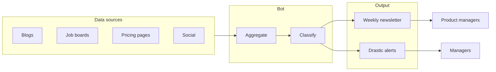
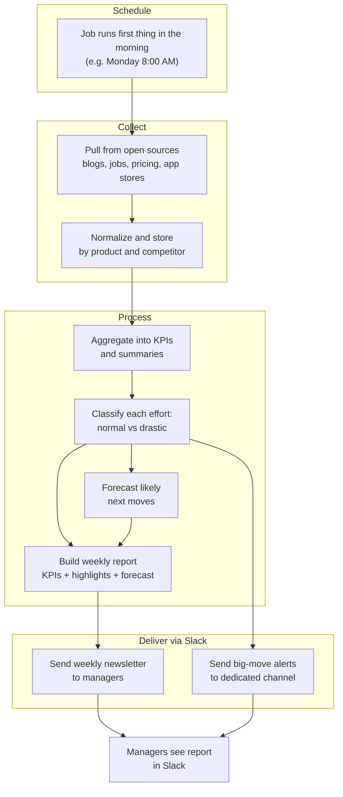

# Product Requirements Document: Tracker Competitors Bot

## 1. Vision and goals

### Problem
There is no centralized, product-level view of competitor activity. Teams manually track competitors, and managers often learn about high-impact competitor moves too late to respond effectively.

### Solution
A bot that aggregates **open and available** competitor signals per product, delivers a **weekly newsletter** with KPIs and key information, and **automatically alerts managers** when competitor efforts are classified as **drastic**.

### Goals
- Improve competitive awareness across product teams
- Reduce manual monitoring and ad-hoc research
- Shorten time-to-awareness for critical competitor moves
- Enable proactive planning by **forecasting likely next moves** from competitors (where possible from open signals)

---

## 2. Users and personas

| Persona | Role | Primary need |
|--------|------|----------------|
| **Product managers / owners** | Consumers of the newsletter | Weekly digest of competitor efforts and KPIs per product |
| **Managers / leadership** | Recipients of drastic-effort alerts | Immediate notification when a competitor move is classified as drastic; may also read the newsletter |
| **Configurator** (optional) | Sets up products, competitors, and rules | Define which products and competitors to track; configure alert rules and recipients |

---

## 3. Product–competitor model

- **Products**: Your company’s products (list or hierarchy to be defined).
- **Competitors**: Per-product or global set of competitors to track.
- **Efforts**: Any trackable competitor action (e.g. product launch, pricing change, feature release, campaign, key hire, partnership) inferred from **open and available** sources only.

**Constraint:** All data must be from **open and available** sources (public information). No unauthorized access or paywalled data unless explicitly in scope with proper licensing.

---

## 4. Core features

### 4.1 Weekly newsletter
- One newsletter per week (or per product per week, depending on scope).
- Contains: KPIs, highlights, and a concise summary of competitor efforts in the period.
- **Delivery**: Sent via **Slack** to the relevant **managers** (and optionally other stakeholders).
- **Schedule**: Runs on a **normal job schedule** (e.g. cron/scheduler), with a **preference to send first thing in the morning** (e.g. Monday 7:00 or 8:00 AM local time) so reports land at the start of the work week.

### 4.2 KPIs and key information
Quantified metrics and key facts derived from public data. Example KPIs (to be refined):
- Number of releases / launches in the last 7 days (per competitor)
- Pricing or packaging changes
- Support or community activity (e.g. forum posts, releases)
- Job postings or hiring signals (e.g. key roles)
- Other open metrics (e.g. app store ratings, public roadmap updates)

### 4.3 Drastic-effort detection
- **Definition**: Criteria or rules to classify an “effort” as **drastic** (e.g. major price cut, large feature launch, key executive hire, acquisition, significant partnership).
- Example criteria (to be refined in implementation):
  - Pricing change above X%
  - New product or major version launch
  - C-level or key role hire
  - M&A or notable partnership announcement
- The exact rules can be tuned over time (thresholds, keyword-based, or manual tagging).

### 4.4 Manager alerting (big moves)
- When an effort is classified as **drastic** (big move), the system **automatically notifies** defined managers.
- **Channel**: A **dedicated Slack channel** for big-move alerts (e.g. `#competitor-big-moves` or `#competitor-alerts`), separate from the weekly newsletter channel, so critical news is easy to find and doesn’t get lost in the digest.
- **Recipients**: Configurable per product or globally (e.g. product lead + manager); they receive alerts in this dedicated channel.
- **Rate-limiting / batching**: Avoid alert fatigue (e.g. cap per day, or batch multiple drastic items into one notification).

### 4.5 Forecasting competitor moves
- **Goal**: Use collected signals and patterns to **forecast likely next moves** from competitors (e.g. upcoming launch, pricing change, expansion) so managers can prepare in advance.
- **Inputs** (all open/available): Historical effort patterns, job postings (e.g. new roles in a domain), roadmap teases or public hints, release cadence, seasonal or cyclical behavior.
- **Outputs**: Short “what to watch” or “likely next moves” section in the **weekly newsletter** (e.g. “Competitor X hiring in area Y — possible push into Z”), and optionally a **dedicated Slack message** in the big-moves channel when a forecast crosses a confidence threshold.
- **Scope**: Start with rule- or pattern-based forecasts (e.g. “they usually release in Q2”; “new VP Product role suggests roadmap shift”); more advanced modeling can be added later.

### 4.6 Impacted apps and pre-visualization (Initiative 1)
- **Goal**: Beyond suggesting a plan, the bot **navigates to our different apps** (from a registry), **identifies which might be impacted** by each competitor action, **proposes the specific changes** per app (e.g. “Pricing page: add headline X and badge Y”), and provides a **pre-visualization** of how the change would look (mock, before/after, or rendered draft). **Nothing is changed automatically** — the bot prepares the view; humans review and approve.
- **Flow**: Competitor action → bot consults app registry → impacted apps listed → proposed changes per app (location, current vs proposed) → pre-visualization generated (copy draft, wireframe, or rendered preview, including for “deep” actions like price changes in billing). Output appears in the report or dashboard; human approves or dismisses.
- **App registry**: List of our apps (e.g. pricing page, homepage, billing app, product signup, sales one-pager) with URLs or routes and which dimensions (pricing, messaging, features) they’re sensitive to, so the bot can select impacted apps per action.
- **Pre-visualization types**: Copy draft, wireframe/mock, rendered preview (e.g. pricing page with new headline), or “deep action” preview (e.g. billing UI with proposed new prices). No automatic deploy.

---

## 5. Data and sources

### 5.1 Principle
Only **open and available** information: public blogs, job boards, changelogs, pricing pages, app stores, social channels, etc.

### 5.2 Candidate source categories
- Official company blogs and changelogs
- Job boards (e.g. LinkedIn, company careers pages)
- Public pricing and product pages
- App stores (releases, reviews)
- Public GitHub repos (if applicable)
- Review sites and public forums
- Social media (public posts)

### 5.3 Attribution and compliance
- Data provenance should be traceable (source + date).
- Respect robots.txt, terms of use, and applicable regulations (e.g. GDPR) when collecting and storing data.

---

## 6. Success criteria and metrics

| Area | Metrics |
|------|--------|
| **Newsletter** | Delivery rate; open/click rates (if measurable); qualitative feedback (“useful”, “actionable”) |
| **Alerts** | Number of drastic alerts sent; time from event to alert; manager feedback on relevance and false positives; usage of dedicated big-moves channel |
| **Forecasting** | Accuracy of “likely next moves” over time (did the forecasted move happen?); manager feedback on usefulness |
| **Coverage** | Number of products and competitors covered; data freshness (e.g. “data no older than X days”) |

---

## 7. Out of scope (v1)

- Real-time dashboard (can be a later phase)
- Non-public or paywalled data without explicit licensing
- Automated response or actions (only monitoring and alerting)
- Deep NLP/sentiment analysis unless explicitly scoped

---

## 8. Open questions and assumptions

### Assumptions
- One newsletter per week is the default cadence.
- Managers are known and contactable via at least one channel (email or Slack).
- “Drastic” can be defined by rules or heuristics and refined over time.

### Open questions
- Which products and competitors to support in the first version?
- Newsletter format in Slack: rich message (blocks), thread with summary + link to full report, or attachment?
- Exact morning time and timezone for the weekly send (e.g. Monday 8:00 AM ET).
- Name of the **dedicated Slack channel** for big-move alerts (e.g. `#competitor-big-moves`).
- How much forecasting to include in v1 (e.g. newsletter-only “what to watch” vs. separate forecast alerts when confidence is high).

---

## 9. High-level flow

---

## 10. Flow prototype: bot process (for manager review)

This section describes the end-to-end process of the bot so you can walk through it with your manager.

### 10.1 Step-by-step process

1. **Schedule triggers (first thing in the morning)**  
   A job scheduler (e.g. cron or cloud scheduler) runs the bot at the chosen time (e.g. **Monday 8:00 AM**). This is the only scheduled trigger for the weekly report.

2. **Collect**  
   The bot pulls data from configured **open sources** (blogs, job boards, pricing pages, app stores, etc.) for each product and its competitors over the last 7 days.

3. **Store / normalize**  
   Raw signals are stored and normalized (e.g. date, source, product, competitor, type of effort) so they can be aggregated and classified.

4. **Aggregate**  
   The bot aggregates the collected data into **KPIs and summaries** (e.g. “Competitor A: 3 releases, 1 pricing change; Competitor B: 2 job postings”).

5. **Classify**  
   Each effort is evaluated against **drastic** rules (e.g. major price change, key hire, big launch). Efforts are tagged as either **normal** (for the newsletter only) or **drastic** (newsletter + alert to dedicated channel).

6. **Forecast (optional)**  
   Using patterns and leading indicators (e.g. job postings, release cadence, public hints), the bot generates **likely next moves** per competitor and adds a short “what to watch” or forecast section to the newsletter (and optionally sends high-confidence forecasts to the big-moves channel).

7. **Build weekly report**  
   The bot builds the **weekly newsletter** content: KPIs, highlights, summary of efforts per product/competitor, and **forecast / likely next moves** (if enabled).

8. **Send weekly newsletter to Slack**  
   The report is sent via **Slack** to the relevant **managers** (and optionally other recipients). Delivery is first thing in the morning so it’s in their channel at the start of the day.

9. **Send big-move alerts (if any)**  
   For each effort classified as **drastic**, the bot sends an **automatic Slack notification** to the **dedicated big-moves channel** (e.g. `#competitor-big-moves`), so managers see critical moves in one place without waiting for the next weekly report.

10. **Repeat**  
    The cycle repeats on the next scheduled run (e.g. following Monday morning).

### 10.2 Process flow diagram

### 10.3 What managers see

| When | What |
|------|------|
| **Weekly (morning)** | One Slack message (or thread) with the **weekly newsletter**: KPIs, key highlights, summary of competitor efforts for the past week, and **likely next moves / forecast** (what to watch). |
| **When something is a big move** | An alert in the **dedicated Slack channel** (e.g. `#competitor-big-moves`) as soon as the bot classifies an effort as drastic, so managers see critical moves in one place without waiting for the next Monday. |
| **Forecast (optional)** | High-confidence “likely next move” alerts can also be posted to the big-moves channel when the bot infers an upcoming significant move from open signals. |

---

*Document version: 1.2 — Tracker Competitors Bot*
