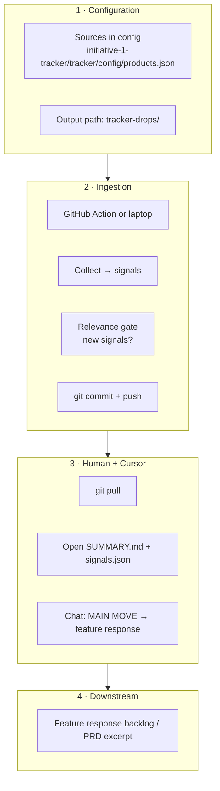

# Tracker Competitors Bot — complete onboarding (one file)

## Is the drop implemented?

**Yes.** In this repository you get:

- **`npm run drop`** → runs **`initiative-1-tracker/tracker/scripts/publish-drop.js`**: collects public signals, then writes **`tracker-drops/<run-id>/signals.json`**, **`SUMMARY.md`**, **`manifest.json`** when there are **new** signals this run (or when **`TRACKER_DROP_FORCE=1`**).
- **GitHub Actions** workflow **`.github/workflows/tracker-drop.yml`** can run the same publish path on a schedule or manually.

If **`npm run`** does not list **`drop`**, you are on an **old branch** or wrong folder — see **Part 5.0** and the **branch** row in the sponsor table below.

---

**Use this as the single handoff document:** how the bot works, **`git clone` paths** for tracker + (**managers**) **`entrata-core`**, manager vs runner, CI / Slack, Cursor interprets (**Part 4**), optional collect-time Entrata wiring (**Part 6**).

**Default assumption in this guide:** you **do not** already have the tracker repository on your computer.

**Repositories:** you **clone two repos for the full manager path** documented here: (**1**) **this** tracker project (**Tracker Competitors Bot**) and (**2**) **`entrata-core`** (internal monolith URL from the sponsor table) — **Part 3.3**. That second clone is **vital for accurate Part 4.4** (parity vs backlog), not optional afterthought. Parts **6+** describe **extras** (workspace template, **`ENTRATA_MONO_ROOT`** for collect, **`app-inventory.json`**) once you are comfortable. **Runners** who only **`git pull`** pre-made drops might skip **`entrata-core`** only if their sponsor excuses **Part 4.4** code checks—but product managers interpreting features should assume **both clones**.

After you clone, this file also lives at the **repo root** — you can **`@TRACKER-EXTERNAL-ONBOARDING.md`** in Cursor from the open folder.

---

## Starting from zero (read first)

**This markdown is not the codebase.** Most people start with **only** `TRACKER-EXTERNAL-ONBOARDING.md` (email, Slack, download, or a small folder that contains nothing else). That includes **managers**: you do **not** need a pre-created “Tracker Competitors Bot” folder (or any tracker folder) on your machine until **you** run **`git clone`**. A copy of this guide sitting in **Downloads** or on the **Desktop** is still **not** the repo.

Until you **clone** with the **HTTPS or SSH URL** from the [Sponsor](#sponsor-one-clone-url--branch) table, you **do not** have:

- `initiative-1-tracker/` — no **`npm run demo`**, **`npm run drop`**, or config on disk yet  
- `tracker-drops/` — no **`SUMMARY.md`** or **`signals.json`** to open yet (those paths exist **inside** the clone after it exists and after drops are produced)

**What to do:** complete **Part 3 — Clone the repo**, then **File → Open Folder…** → the **directory `git clone` created** (the folder that contains `README.md` and `initiative-1-tracker/`). Stop opening “only this handout file” as your project root once the clone exists—use the **clone** as your Cursor folder for **Part 4** (manager) and optional **Part 5** (runner).

---

## Sponsor: one clone URL + branch

**Fill unused cells before sending externally.** For **this** repository the example values below are canonical; forks replace URLs only.

Blocking choke point for managers: **`entrata-core`** URLs (**below**) must be real before interpret matches **§4.4** — incomplete sponsor cells mean they cannot parity-check **`Status:`**.

| Field | Value |
|-------|--------|
| **HTTPS clone URL** | `https://github.com/alonsoroca-gif/Tracker-Competitors-Bot.git` |
| **SSH clone URL** | `git@github.com:alonsoroca-gif/Tracker-Competitors-Bot.git` |
| **Branch to `checkout` after clone** | **`agent/P1.1`** today — **`npm run drop`** and **`scripts/publish-drop.js`** are on this branch. **`main`** still omits **`drop`** until merged; do not assume **`main`** has the runner scripts unless you verify with **`npm run`**. |
| **`entrata-core` HTTPS clone URL** *(managers)* | *(sponsor fills — internal monolith HTTPS URL)* |
| **`entrata-core` SSH clone URL** *(managers)* | *(sponsor fills — internal git@… URL; write “N/A” if org is HTTPS-only)* |
| **`entrata-core` default branch** *(if not `main`)* | *(sponsor fills — e.g. `develop`)* |
| **Who to ask for access** | *(both repos — sponsor / IT ticket)* |

**Part 3.3:** managers paste **`entrata-core`** URL from HTTPS or SSH row above (`git clone <URL>`).

### Sponsor checklist — before external handoff or demo day

Quick **copy for sponsors** ([timing detail → Appendix](#appendix--official-demo-how-long--what-to-tighten-first)):

| # | Check |
|---|--------|
| **1** | Tracker **HTTPS**, **SSH**, and **checkout branch** cells are correct (fork swaps tracker URLs only). |
| **2** | **`entrata-core` HTTPS / SSH / branch** rows are filled — smoke-test **`git clone`** once (**§3.3**) under real VPN/MFA so demo day isn’t blocked. |
| **3** | **Who to ask for access** names a queue that actually grants **both** repos. |
| **4** | You told joiners **`agent/P1.1`** (or whatever you put in branch row) matters for **`npm run drop`**. |

Forks: replace tracker URLs only; **`entrata-core`** stays internal sponsor fill.

### How this file usually arrives (sponsors read this)

| How you send it | What the user gets | Do they need to make a folder? |
|-----------------|-------------------|--------------------------------|
| **Link to GitHub** (raw or “Download” on the file) | Usually **one downloaded `.md`** in **Downloads** | **No.** Cursor: **File → Open File…** picks the file as-is. Optional: move it into any folder if they prefer **Open Folder…** on a directory. |
| **Email / Slack attachment** (single file) | Same — **one file** on disk | **No** folder required to read it. |
| **Zip of a small folder** (e.g. zip `tracker-handoff/` containing this `.md`) | After **double‑click unzip**, they get a **folder** automatically | **No** manual step; they can **Open Folder…** on that folder. *You* create the zip once: put this file in a folder, compress the folder, attach the zip. |
| **`git clone` the repo** | **Whole project folder**; this guide is at **repo root** | **No.** Clone creates the folder; they **Open Folder…** on the clone. |

There is **no** standard way to make a **single attachment** “download as a folder” without a **zip** or **git clone**. Easiest “folder experience” without the full repo: **zip a folder** that only contains **`TRACKER-EXTERNAL-ONBOARDING.md`** — and remind them that **zip alone still does not include the tracker code**; they must **clone** per **Part 3**.

---

## Part 0 — Recommended first-time flow (open this file, then clone)

Many people find it easier to **read the guide first**, then get the code. That order is fine.

### What you have vs. what you need

| Situation | What’s on disk | What to do |
|-----------|----------------|------------|
| **Guide only** | Just this `.md` file (or a folder with only this file) | You **cannot** open **`tracker-drops/`** or run **`npm`** until you **clone** (Part 3). Paste the sponsor’s **clone URL** there—**nowhere else** creates the repo. |
| **After tracker `git clone` only** | One folder (`README.md`, `initiative-1-tracker/`, `tracker-drops/`, `.github/`) | **§3.2** open Tracker → **§3.3** clone **`entrata-core`** + **Add Folder to Workspace…** (**managers**). |
| **After tracker + `entrata-core` clones** | Tracker folder + **`entrata-core`** (often siblings under `~/Projects`) | Cursor **multi-root** both (**Part 3.3**) → **Part 4** + **§4.4** parity-ready. |

### Manager on a laptop with no tracker folder yet

1. Get the **clone URLs** (**tracker + `entrata-core`**) and **tracker branch** from the [Sponsor](#sponsor-one-clone-url--branch) table.  
2. Follow **Parts 3.1 → 3.3** in Terminal (**tracker clone**, then **`entrata-core`**).  
3. In Cursor: **Open Folder…** Tracker, then **Add Folder to Workspace…** → **`entrata-core`**.  
4. Follow **Part 4** — **`git pull`**, then **`tracker-drops/…`**. You do **not** need Node for this path if you only read drops and use Chat.  
5. Optional: try **Part 5.2** (`npm run demo`) if you want to see sample output; that needs **Node** and `cd` into **`initiative-1-tracker/tracker`** inside **your** clone.

### Steps (every new joiner)

1. **Receive** this markdown file (and the filled-in table above) from your sponsor.  
2. **Open Cursor** → **File → Open File…** → select **`TRACKER-EXTERNAL-ONBOARDING.md`** (from Downloads, email attachment, etc.).  
3. **Skim** Parts 1–2 so you know what the bot does and what you will clone.  
4. **Clone** the repository using **Part 3** (Terminal — this file does not run `git clone` for you). **Do not skip this** — it is the only way to get **`tracker-drops/`**, **`npm run demo`**, or **`npm run drop`** on your machine.  
5. **File → Open Folder…** in Cursor → choose the **folder created by clone** (contains `README.md` and `initiative-1-tracker/`). Its path is **yours** (e.g. `~/Projects/...`), not a teammate’s Desktop.  
6. Continue with **Part 4** (manager) and/or **Part 5** (runner). Optional: Chat with **`@TRACKER-EXTERNAL-ONBOARDING.md`** using the copy **at repo root** inside the clone.

**Why clone?** The tracker’s **evidence** (`tracker-drops/…`), **config**, and **scripts** live in the repo. This guide is instructions only.

### First session: manager then optional runner (recommended)

After **Part 3** and opening the **cloned** folder—not a folder that only contained this guide:

1. **Manager (quick):** **Part 4.1–4.4** — **`git pull`**, **`tracker-drops/…`**, then interpret with **Part 4.3–4.4** (features‑only MAIN MOVE + **feature response** prototype — not pricing). If there is no run folder yet…  
2. **Runner (quick):** **Part 5.1–5.2** — `cd` to **`<your-clone>/initiative-1-tracker/tracker`**, **`npm install`**, **`npm run demo`** (sample data; confirms the app runs).  
3. **Optional:** **`npm run drop -- --days 7`** (Part 5.3), then repeat the **manager** steps on new files; use **`TRACKER_DROP_FORCE=1`** if the run skipped writing a folder because there were zero new signals (Part 5.3).

---

## Manager journey — start to finish

**Who this is for:** you are a **manager** — **`git pull`** fresh evidence → **interpret** in Cursor with **`entrata-core`** beside the tracker (**Parts 3.2–3.3**).

**About `git push`:** **`push`** after **you gathered new intel inside this repo** (almost always: you ran **`npm run drop`** and there are **new/edited tracked files under `tracker-drops/`**). **`git pull` → interpret → paste to Slack/Product OS only** ⇒ **no `push`** unless your team mandates a versioned **`INTERPRETATION.md`** (see **[C]** second row).

### A) First time only (from “I only have this PDF/MD” → ready to work)

| Step | What you do | Where in this guide |
|------|-------------|---------------------|
| **1** | Read **Starting from zero** + **Sponsor** table — copy **tracker clone URL**, **tracker branch**, and **`entrata-core` clone URL** | Top of this file |
| **2** | **`git clone`** tracker → **`checkout`/`pull`** on the tracker branch | **§3.1** |
| **3** | **`git clone`** **`entrata-core`** → **`checkout`/`pull`** per internal norms | **§3.3** |
| **4** | Cursor: **Open Folder…** Tracker, then **Add Folder to Workspace…** → **`entrata-core`** (multi-root) | **§3.2–3.3** |

### B) Every time you interpret a drop (pull → read → Cursor)

| Step | What you do |
|------|-------------|
| **1** | Terminal: **`cd /path/to/your-clone`** (repo root) |
| **2** | **`git fetch origin`** then **`git pull origin <BRANCH>`** — same branch as the sponsor table (**Part 4.1**) |
| **3** | In Explorer: **`tracker-drops/.latest-drop-id`** → note the run id |
| **4** | Open **`tracker-drops/<run-id>/SUMMARY.md`**, then **`signals.json`** (**Part 4.2**) |
| **5** | Apply the **manager filter:** **features only** — **ignore pricing** even if it appears in JSON (**Part 4.2**) |
| **6** | In **Chat** or **Composer**: **`@`** those files (and **`@`** `entrata-core` / key classes if you use **Part 4.4**) |
| **7** | Paste the **Part 4.3** prompt — pick model per **Part 4.3.1** (larger drops / strict rules → stronger tier, e.g. Opus class) |
| **8** | Produce **MAIN MOVE + FEATURE TABLE**, then **§ Feature response** with **`Target:` / `Status:` / `Action:`** per **Part 4.4** and **§4.4.1** |
| **9** | **Hand off** the text where the team expects (Slack, doc, deck). **Skip `git push`** unless you also produced repo changes (**[C]**). |

### C) Manager **`git push`** — when **you gathered intel into the repo**

Treat **`push`** as “new **tracked** artefacts others must pull”: almost always **`tracker-drops/`** from **`npm run drop`** (**Part 5.3**) you ran locally — i.e. you **gathered** competitors’ evidence yourself rather than consuming someone else’s last push alone.

| Situation | Typical commands (from **repo root**) |
|-----------|----------------------------------------|
| **`npm run drop`** wrote or updated **`tracker-drops/`** — **usual manager-push scenario** when you self-publish | **`git status`** → **`git add tracker-drops`** → **`git commit -m "…"`** → **`git push origin <BRANCH>`** — detail **Part 5.4** |
| Sponsor policy: version **`INTERPRETATION.md`** (etc.) beside a run folder | **`git add tracker-drops/<run-id>/…`** → **`commit`** → **`push`** — uncommon |

Routine **consume-only** workflow: **`pull` → interpret → Slack** ⇒ **do not push**.

*Branch name and PR rules follow your sponsor (`git branch -a`).*

### D) Needed new drop before you interpret?

When **`git pull`** still shows **no usable run**, your sponsor expects **you** to collect: **Part 5.0–5.3** (`npm install` once, **`npm run drop`**), then **repeat section B)** on **`tracker-drops/`**, then **section C)** to **`push`** — **Part 5.4**.

---

## Part 1 — What the bot does (short)

- Collects **public** competitor signals (RSS, marketing pages, careers, etc.) from URLs in config.  
- Stores and prunes signals under `initiative-1-tracker/tracker/data/` during collect.  
- When a run adds **new** signal rows (relevance gate), it can write **`tracker-drops/<run-id>/`** with **`SUMMARY.md`**, **`signals.json`**, **`manifest.json`**, and updates **`tracker-drops/.latest-drop-id`**.  
- **Managers** `git pull`, read the drop in **Cursor**, interpret in Chat/Composer (see **Part 4.3–4.4**: **features-only** briefing + **feature response** prototype), then hand off where the team expects — no required `localhost:3000` dashboard.  
- **Runners** run **`npm run drop`** locally and/or rely on **GitHub Actions** to commit/push.

### Diagram — pipeline



### Three jobs (same idea always)

| Job | What |
|-----|------|
| **Collect** | Fetch public sources; normalize; **no** org LLM required here. |
| **Interpret** | Human + **Cursor** on committed files (SUMMARY, signals). |
| **Durable record** | **Git commit** on the agreed branch = source of truth for “what we knew this run.” |

---

## Part 2 — What lives where (after clone)

| Path | Purpose |
|------|---------|
| **`tracker-drops/<run-id>/`** | Evidence for managers: **`SUMMARY.md`** first, then **`signals.json`**. |
| **`tracker-drops/.latest-drop-id`** | One line = newest run id. |
| **`initiative-1-tracker/tracker/`** | Node app: **`npm run collect`**, **`npm run drop`**, **`npm run demo`**. |
| **`initiative-1-tracker/tracker/config/products.json`** | Products, competitors, **source URLs** (blog, pricing, careers, …). |
| **`initiative-1-tracker/tracker/config/our-state.json`** | Our delivery state per dimension (for gap copy). |
| **`.github/workflows/tracker-drop.yml`** | Scheduled / manual **Tracker drop** workflow. |

**Never commit:** API keys, private URLs, PII. Use **Settings → Secrets** on GitHub for CI.

---

## Part 3 — Clone the repo (Git + Cursor)

**Prereqs:** [Git](https://git-scm.com/). **Runners** also need [Node.js 18+](https://nodejs.org/).

### 3.0 No folder on your machine until you clone

You should **not** already have the repository unless you cloned it yourself before. **Do not** look for a folder on someone else’s **Desktop** or a shared path—**`git clone`** creates **your** copy wherever **you** run it. After clone, the new directory name is usually the **repo name** (examples below use `Tracker-Competitors-Bot`; your org’s name may differ). Use **`pwd`** (macOS/Linux) or check the path shown after `cd` so you know where to point **File → Open Folder…** in Cursor.

### 3.1 Terminal — clone **this** repo only

Pick a parent folder (`~/Projects`, `~/Desktop`, etc.):

```bash
cd ~/Projects
git clone <PASTE-HTTPS-URL-FROM-SPONSOR-TABLE>
cd <REPO-FOLDER-NAME>    # folder Git created; name matches repo (e.g. Tracker-Competitors-Bot)
git checkout <BRANCH-FROM-SPONSOR-TABLE>
git pull origin <BRANCH-FROM-SPONSOR-TABLE>
```

Use the **SSH** URL from the sponsor table instead of HTTPS only if they gave you one.

### 3.2 Open Tracker in Cursor (first folder)

**File → Open Folder…** → select the **folder you just cloned** (e.g. `Tracker-Competitors-Bot`, or whatever name appears after `git clone`).

**Other options:** **GitHub Desktop** → Clone → paste URL → choose parent folder — GitHub Desktop creates the repo folder; then **Open Folder…** on **that** directory in Cursor.

### 3.3 Clone **`entrata-core`** (managers — do this with the tracker clone)

**Why:** Part **4.4** requires searching **your shipped code** before writing **`Status:` / `Action:`**. Without **`entrata-core`** in Cursor, interpretations drift toward fake “build this” backlog items.

**Prereqs:** internal Git access — paste clone URL + branch from **`entrata-core` HTTPS / SSH / default branch** rows in the [Sponsor](#sponsor-one-clone-url--branch) table (sponsor checklist must pass before handoff).

Stay in **the same parent directory** as the tracker repo (keeps paths predictable), then:

```bash
cd ~/Projects   # or whatever parent held your tracker clone above
git clone <PASTE-ENTRATA-CORE-URL-FROM-SPONSOR>
cd <ENTRATA-REPO-FOLDER>     # folder Git created — often entrata-core
git checkout <ENTRATA-BRANCH-FROM-SPONSOR-TABLE>
git pull origin <ENTRATA-BRANCH-FROM-SPONSOR-TABLE>
```

**Cursor — multi-root (recommended):** **File → Add Folder to Workspace…** → select the **`entrata-core`** checkout you just cloned. You now have **two workspace roots**: **Tracker Competitors Bot** + **`entrata-core`**. Chat can **`@`** paths under both (**Part 4.4**).

**One-folder-only (discouraged for managers):** you can **`@`** **`entrata-core`** by absolute path from a tracker-only workspace, but multi-root avoids path mistakes.

Collect-time integration (**`ENTRATA_MONO_ROOT`**, **`app-inventory.json`**, workspace JSON template) stays in **Part 6** once you advance past basic interpret.

---

## Part 4 — Manager path

**Assumption:** you completed **Parts 3.1–3.3** — **Tracker clone** + **`entrata-core`** in Cursor for **§4.4** parity gates. **Git** required; Node only if you also run **`npm`** (**Part 5**).

### 4.1 Update the clone

In Terminal, **`cd`** to **your** clone—the directory that contains `README.md` (same path you used for **File → Open Folder…**):

```bash
cd /path/to/<YOUR-CLONE-OF-REPO>
git fetch origin
git pull origin <BRANCH>
```

Use the **same branch** from the sponsor table (the one you **`git checkout`** in Part 3).

### 4.2 Find the latest drop

1. Open **`tracker-drops/.latest-drop-id`** — copy the run id.  
2. Open **`tracker-drops/<run-id>/SUMMARY.md`** for counts and pillar snapshot only (fast read).  
3. Open **`tracker-drops/<run-id>/signals.json`** — this is where **feature-level excerpts** live.

**Manager filter (defaults for Part 4.3–4.4):** Prefer signals about **capabilities and product-facing claims** (`features_page`, product-relevant **`blog`** snippets, **`careers`/`job`** only when tied to obvious **product/engineering investment**). **Skip entirely** interpretation of **pricing** for this funnel: ignore rows whose **`source`/`type`** is **`pricing`**, **`pricing_page`**, or whose **`snippet`** is mainly tiers, SKU, **`$/mo`**, trials, promotions, discounts, or billing — even though they may appear in **`signals.json`** from collect.

**Empty?** If there is no run folder (only `README.md` under `tracker-drops/`), no drop was committed for that period — usually **no new signals** this run. Ask a runner to trigger a drop or use `TRACKER_DROP_FORCE=1` for a training run (Part 5).

### 4.3 Interpret in Cursor — straightforward, features-only

Managers need a **lead message** plus **facts**, not encyclopedic scans.

1. **`@`** **`SUMMARY.md`** and **`signals.json`**.
2. **Copy-paste prompt** from the fenced block below (edit product name internally if sponsors standardize wording).

```
Use ONLY the attached SUMMARY.md and signals.json.

Rules:
- Do NOT summarize, prioritize, cite, or score pricing: skip signals whose source/type is pricing or pricing_page, or snippets about tiers, $/mo, trials, SKU, promotions, billing, cancellations.
- Focus ONLY on product features and capability claims (marketing site features pages, substantive product-news blog excerpts, careers/hiring snippets only when they're clearly tied to shipped product/engineering areas).

Deliver:
A) MAIN MOVE — Exactly ONE of (pick the clearer structure):
    (Option 1) A single headline sentence (max 20 words): who made the strongest product/feature move this window?
    OR (Option 2) Exactly one sentence per competitor (max 15 words each), bullet list — max three competitors ranked by relevance to Prospect experience / CRM / AI automation (use only wording supported by excerpts).
B) FEATURE TABLE — For each substantive feature claim remaining, ONE row only: Competitor | Feature/capability in plain English | citation = source field + ISO date + ≤25-word excerpt from file.
Stop after table. No themes, pillars, positioning essays, risks, battlecard prose, GTM fluff.
```

3. **Rule:** No live web unless your org overrides — **committed files only.**

### 4.3.1 Cursor model picker — pick by **context**, not habit

**Chat** or **Composer** both work for Parts **4.3–4.4**. You separately choose the **underlying model** in Cursor’s **model dropdown** (“Search models”). Cursor changes its lineup over time — **pick by tier** (Opus / Sonnet / medium GPT‑5.x / Codex / fast Composer), not the exact slug.

#### Step A — read the drop’s **context signals** first

Open **`SUMMARY.md`** + **`manifest.json`** and check:

1. **Volume** — `new_signals_added` and **lines in `signals.json`** (a quick `wc -l` or scrolling). Use rough buckets: **small ≤300 rows · medium 300–1500 · large 1500+**.
2. **Spread** — `pillars_touched_this_run` and `coverage_report` in **`SUMMARY.md`**: only **P1**? P1+P2? Multi‑pillar with P3/P4 too?
3. **Audience for the output** — *“Slack post for me”*, *“weekly intel doc for the team”*, or *“exec / customer‑facing brief”*?
4. **Strictness** — does the run produce many **pricing**/promo rows that must be filtered? Many noisy `careers` rows? More filtering = stricter model.
5. **Are we also editing files?** — pure prose vs Composer thread that also edits **`config/`**, scripts, etc.

#### Step B — pick the model from the context

| Context (from Step A) | Recommended model tier | Why |
|------|------|------|
| **Quick personal triage** — small drop, single pillar, output is a Slack post for yourself | **Fast Composer** (e.g. `composer-2-fast`) **or** Sonnet | Latency wins; format is forgiving. |
| **Standard weekly brief** — medium drop, P1+P2, audience = team channel / doc | **Sonnet (`claude-4.6-sonnet`)** *or* **`gpt-5.5-medium`** | Best quality‑per‑second for routine intel. Default for most managers. |
| **Exec / stakeholder review** — strict format, citations matter, output must read “executive grade” | **Opus (`claude-opus-4-7-xhigh`)** | Highest fidelity to “MAIN MOVE shape”, restraint, no speculation. Worth the latency. |
| **Large drop** — `signals.json` >1500 rows or multi‑pillar synthesis | **Opus** preferred; **Sonnet** acceptable | Stronger long‑context reasoning; less drift. |
| **Heavy filtering needed** — many pricing / careers / off‑topic rows to ignore per Part 4.2 | **Opus** > Sonnet > GPT‑5.5 | Larger reasoning models follow exclusion rules more reliably. |
| **Composer thread mixing intel + light code edits** (rename in `config/`, scripts) | Switch to **`gpt-5.3-codex`** for edits, switch back to **Sonnet/Opus** for the brief | Codex is biased toward edits, weaker on prose synthesis. |
| **You only need bullet sanity check** of an existing brief | **Sonnet** or **`gpt-5.5-medium`** | Cheaper second pass. |

#### Step C — escalation rule

If the first model’s output **drifts** (mentions pricing, skips citations, or MAIN MOVE goes vague):

1. **Step up one tier** (Composer → Sonnet → Opus) **before** rewriting the prompt.
2. If still off, narrow the input: pre‑filter **`signals.json`** to feature‑only rows (or pass only `SUMMARY.md` first), then run the strict prompt again.

**Hard rule:** never default to **`composer-2-fast`** (or older **Composer 1.x**) for **exec‑facing** Part 4.4 deliverables.

*Toggles (**Auto**, **MAX Mode**, **Use Multiple Models**): optional; leave off unless your org standardizes otherwise. **Auto** can pick a fast tier automatically — turn it **off** when you’re producing the exec brief and want Opus deterministically.*

### 4.4 Prototype deliverable — **feature response** (required shape)

Export the Chat output into wherever the team expects (Product OS, doc, Slack). Default format is **not** a vague “strategy brief.” It MUST include a labeled section:

**§ Feature response prototype**

Before you draft line **2**, **check Entrata `entrata-core` first.** Open your org clone in the same Cursor window (recommended: **multi-root** — tracker repo + **`entrata-core`**) so you can **`@`** folders or **`@`** key files (`rg`/Chat search counts). Typical clone location is something like **`…/Core Repo/entrata-core/`** on your laptop — sponsor may standardize.

**Gate (do not skip):**  
- Search the repo for the **nearest existing capability** (module name, routing flag, VOIP/marketing/leasing artifact).  
- If it **already ships**, line **2** must say so explicitly (**“Existing in…”** naming the UI/code surface) and point to a **concrete anchor** when possible (PHP class/controller, notable route flag like `live_chat_guest_card`, or VOIP/analysis type). Only use **Gap —** wording when search shows no reasonable equivalent **or** the gap is a **narrow** delta (hours, UX, packaged naming, automation depth)—not vague “ship a chat surface.”

**What the bot does *not* do:** `npm run drop` only **collects competitor evidence** into `tracker-drops/` — it never inspects Entrata. **You** (manager + Cursor + `entrata-core`) decide parity vs gap.

**Backlog / “new features” lens:** It is normal for **many** rows to become **`Status: Existing`** after a core check. Those rows are still valuable for **sales truth and battle‑cards** (we already have X in Y), but they are **not** net-new product backlog. Treat **roadmap candidates** as only: **`Gap`**, or **`Needs verification`** that **remains** a real gap after PM/eng checks (e.g. missing behaviour, not just different marketing copy). *Optional but recommended:* end with a short **“Gap-only summary”** (bullets) so leadership reviews **new work** in one glance.

For **each row** from the interpreter’s FEATURE TABLE above, append **exactly three lines**:

1. **Competitor feature (restated)** — one short phrase  
2. **Our Entrata response** — **one sentence** with **three tags** (in this order, same sentence): **`Target:`** (product / submodule — see examples under Part 4.4 intro) **`Status:`** (pick **exactly one** label from the table in **§4.4.1** below) **`Action:`** (follow the **Action pattern** in **§4.4.1** — owner + verb + deliverable + timebox or trigger).  
3. **Evidence cited** — same competitor **signals.json** fields as the FEATURE TABLE row; **plus** optional **entrata-core** anchor if you asserted *Existing/Gap* (file path snippet is enough).

#### §4.4.1 **`Status:`** and **`Action:`** — make these precise

**`Status:` — use exactly one of:**

| Label | When to use it |
|--------|----------------|
| **Existing** | You found a **concrete** core anchor (class, route flag, module, VOIP schema, etc.) that implements the capability; customer-facing naming may still differ from the competitor. |
| **Needs verification** | Search suggests parity **or** partial parity, but **you cannot** yet claim Existing or Gap without PM, sales, or eng **confirming behaviour, config, or packaging** (most common after a quick grep). |
| **Gap** | After a fair core search: **no** reasonable implementation **or** PM/eng has **confirmed** missing behaviour / a **narrow** delta worth tracking (automation depth, net-new workflow—not rewording only). |
| **Out of scope** | Not a product capability response (e.g. pure **hiring**, **funding**, **event PR**); optional one-line **Action** for leadership only. |

**`Action:` — use this pattern:** **`[Owner]`** + **`[verb]`** + **`[deliverable]`** + **`[timebox or trigger]`**  
- **Owner:** PM, Eng, RevOps, Marketing, Legal, or **Joint (PM+Eng)** — pick one responsible party.  
- **Verb:** commit to an outcome (*document*, *confirm*, *create*, *add*, *remove*, *schedule*, *spike*, *instrument*) — avoid empty *review*, *align*, *explore* unless paired with a **named artefact**.  
- **Deliverable:** what someone can paste or attach (battle-card bullet, wiki link, spike doc, screenshot set, GA definition, dashboard name, epic link).  
- **Timebox or trigger:** *by \<date/sprint\>*, *after \<meeting/sign-off\>*, or *if \<customers ask for X\>*.

**Weak vs strong examples (same competitor row):**

- **Weak Action:** “Align messaging and socialize with stakeholders.”  
- **Strong Action:** “Marketing: add **one battle-card paragraph** + **two screenshot callouts** to the competitive wiki **by \<sprint\>** after PM confirms chat coverage hours.”

- **Weak Action:** “Verify VoIP.”  
- **Strong Action:** “Joint (PM+Eng): **30-min spike** to confirm whether AI/voice calls land on the **prospect timeline** with analysis status; **deliver** 3-bullet finding to Slack **\<date\>**.”

If you cannot cite a competitor feature row, **do not invent** response lines.

*Optional:* Add a final line **Prioritization recommendation** (“Now / Later / Won’t chase”) tied only to cited features.

Still no **`localhost`** required.

---

## Part 5 — Runner path

### 5.0 Terminal: use the tracker app folder first

Integrated terminals usually open in the **workspace root** (e.g. a parent folder like **Tracker DEMO**), not in the tracker code. **Before** `npm run drop` or `npm run demo`, change directory to the Node app:

```bash
cd /path/to/<YOUR-CLONE-OF-REPO>/initiative-1-tracker/tracker
```

From a **multi-folder** workspace, that path is often **`Tracker-Competitors-Bot/initiative-1-tracker/tracker`** relative to the parent folder. Shortcut: in the Explorer, **right‑click** the **`tracker`** folder (the one that contains **`package.json`** and **`index.js`**) → **Open in Integrated Terminal**.

Sanity check — **`drop`** must appear in the list:

```bash
npm run
```

If you see **`Missing script: "drop"`**, you are in the **wrong directory** or on a **Git branch** whose `package.json` does not define **`drop`** yet (see Part 7 — *not* the same as “no new signals this week”).

- **`npm run drop`** needs **`scripts/publish-drop.js`** and **`drop`** in **`package.json`**. If missing, you are on the wrong **branch** — **`git checkout`** the branch your sponsor put in the table (not necessarily `main`).

### 5.1 One-time setup

```bash
cd /path/to/<YOUR-CLONE-OF-REPO>/initiative-1-tracker/tracker
npm install
```

Optional: copy **`.env.example`** → **`.env`** if your team documented keys (many public-source runs work without it).

### 5.2 Sanity check (sample data, does not write Git drops)

```bash
npm run demo
```

### 5.3 Collect + publish drop

```bash
npm run drop -- --days 7
```

- **No new folder?** If **zero new signals**, the script **skips** writing `tracker-drops/<run>/` (by design).  
- **Training / demo only:**

```bash
TRACKER_DROP_FORCE=1 npm run drop -- --days 7
```

### 5.4 Commit and push (manual)

From **repo root**:

```bash
cd /path/to/<YOUR-CLONE-OF-REPO>
git add tracker-drops
git status
git commit -m "tracker drop: manual run"
git push origin <BRANCH>
```

### 5.5 GitHub Actions (“the bot”)

1. Repo → **Actions** → **Tracker drop** → **Run workflow** (manual), or wait for **schedule** (default **every 15 minutes** UTC in `.github/workflows/tracker-drop.yml` — your org may change this).  
2. Workflow runs **`publish-drop.js`** → **`tracker-drops/`** only gets a **new** run when **`newCount > 0`** (unless you add `TRACKER_DROP_FORCE` in the workflow for debugging).  
3. If **`git add tracker-drops`** has changes, the job **commits and pushes** to the branch the workflow runs on.

**Branch protection:** If pushes to `main` are blocked, adjust policy with your admin (dedicated branch, PAT, or PR flow) — same constraints as any CI bot.

**Secrets (repository):**

| Secret | Required? | Purpose |
|--------|-----------|---------|
| *(default)* `GITHUB_TOKEN` | Yes (Actions) | Push to **this** repo when `permissions: contents: write`. |
| `SLACK_WEBHOOK_URL` | No | Incoming Webhook; if unset, Slack step is skipped. |

**Slack (optional):** Create Incoming Webhook in Slack → add **`SLACK_WEBHOOK_URL`** under **Settings → Secrets and variables → Actions**. After a successful push, **`slack-drop-notify.js`** can post a short summary + commit link. Admin approval may be required in locked-down workspaces.

**Second remote:** Only if drops must land in a **different** repo than this code — needs a PAT secret and a custom push step; see **`initiative-1-tracker/docs/TRACKER-DROP-CI.md`** for the pattern.

---

## Part 6 — Optional: **`ENTRATA_MONO_ROOT`**, workspace file & **`app-inventory`**

Managers already **`git clone`'d `entrata-core`** in **Part 3.3** for Cursor parity checks (**Part 4.4**). **This section** is for **extras** once you advance past baseline interpret/runner flows:

Use this when **`npm run collect` / `npm run drop`** should read filesystem paths inside the monolith, or when you want the checked-in **`.code-workspace`** template.

1. **`entrata-core`** checkout **already sits** beside the tracker (**Part 3.3**) — keep it updated with **`git pull`** per internal norms.  
2. **File → Add Folder to Workspace…** if you skipped multi-root earlier.  
3. Add **both roots:** this **Tracker** repo + **`entrata-core`** (tree that contains **`Applications/`**, etc.).  
4. Copy **`entrata-plus-tracker.code-workspace.example`** → **`entrata-plus-tracker.code-workspace`**, edit paths, open the workspace in Cursor (optional shortcut to step 3).  
5. For collect features that read the monolith, set **`ENTRATA_MONO_ROOT`** in the shell you use for **`npm run collect`** / **`npm run drop`** (path to `entrata-core` root).  
6. **`initiative-1-tracker/tracker/config/app-inventory.json`** ties products to app paths — **`initiative-1-tracker/docs/ENTRATA-CODE-IN-CURSOR.md`** for detail.

---

## Part 7 — Troubleshooting

| Symptom | What to try |
|---------|-------------|
| **`npm error Missing script: "drop"`** | The shell is **not** in **`initiative-1-tracker/tracker`**, or your checkout’s **`package.json`** has no **`drop`** script (e.g. older **`main`**). **Not** “zero signals.” Fix **`cd`**, run **`npm run`** to confirm **`drop`** exists, or **`git checkout`** / **`git pull`** the branch your team uses for the full tracker (see **`scripts`** in `package.json`). |
| No new folder under **`tracker-drops/`** after **`npm run drop`** succeeds | Only then: often **no new signals** in the window; use **`TRACKER_DROP_FORCE=1`** for a demo; or widen **`--days`**. |
| **`npm run drop`** very slow | Expected — many HTTP requests during collect. |
| **Actions** never commits | No change under `tracker-drops/`; workflow disabled; or branch protection — see Part 5.5. |
| **`git clone`** fails | VPN, URL typo, or no GitHub access — contact sponsor / IT. |
| **`git push`** denied | Need write access or use a PR branch per policy. |
| **`npm install`** errors | Use **Node 18+**; run from **`initiative-1-tracker/tracker`**. |

---

## Part 8 — Deeper reference (inside the clone)

Use these when you need full detail beyond this onboarding:

| Topic | Path in repo |
|-------|----------------|
| Full architecture + extra diagrams | `initiative-1-tracker/docs/TRACKER-FLOW-END-TO-END.md` |
| CI, cron, Slack checklist, second remote | `initiative-1-tracker/docs/TRACKER-DROP-CI.md` |
| Source URLs and collect behavior | `initiative-1-tracker/docs/COMPETITOR-DATA-PULL-REFERENCE.md` |
| How gaps read in the product (L1/L2) | `initiative-1-tracker/docs/COMPETITIVE-INTEL-PRESENTATION.md` |
| Rule-based interpretation in code | `initiative-1-tracker/docs/STRATEGIC-INTERPRETATION.md` |
| Multi-root + `ENTRATA_MONO_ROOT` | `initiative-1-tracker/docs/ENTRATA-CODE-IN-CURSOR.md` |
| Docs index | `initiative-1-tracker/docs/README.md` |

**Legacy local HTML report (dev only):** `npm run serve` under `initiative-1-tracker/tracker` — **not** the default manager path.

---

## Appendix — Official demo: how long & what to tighten first

**Rough time on the clock** (assume corporate laptop, MFA, repos already reachable):

| Path | Calendar time | Notes |
|------|----------------|-------|
| **Skim onboarding + clone Tracker + §3.3 `entrata-core` + Cursor multi‑root** — first time only | **~45–120 min** | **`entrata-core`** is large; clones dominate. Do this **once** ahead of demo day under real VPN. |
| **Manager loop only** (**`pull` → open SUMMARY/`signals.json` → Part 4.3–4.4 with core search**) — after setup | **~40–90 min** | Depends on **`signals.json` size**, model tier, how deep **`entrata-core`** search goes. Huge JSON + Opus ⇒ **budget ~60 min** for polish. |
| **Add Runner slice** (**`npm install`**, **`npm run demo`**, optional **`npm run drop`**) | **~20–75 min** | **`demo`** shorter; **`drop`** = network-bound. |
| **`git commit` / `push`** when they **gathered** a drop (**Manager journey §C**) | **~10–25 min** | Access, branch policy, first-time **`git`** wrangling. |

**Full “first-ever” dry run end-to-end** (clone both + interpret deeply + **`npm run drop`** + **`push`**): realistically **half day** if anything blocks (access, clones, timeouts); **~2½–4 hrs** uninterrupted if lucky.

### Before an official demo — high‑value refinements

1. **[Sponsor checklist](#sponsor-checklist--before-external-handoff-or-demo-day)** — all table cells filled; **`entrata-core`** **`git clone`** smoke-tested once (**§3.3**, real VPN/MFA). Do this enough ahead of demo that access issues don’t surface live.
2. **Pick one story arc for the session:** Either **consume** a committed **`tracker-drops/`** run *or* live **`npm run drop`** — not both cold on stage unless timing is padded. **`npm run demo`** alone is safest “app runs” proof (**Part 5.2**).  
3. **Shorten Cursor time:** Pre-attach **`SUMMARY.md`** + trimmed **`signals.json`** slice *or* one representative run folder; full **multi‑KB JSON** steals airtime (**Part 4.3**).  
4. **Status/Action practise:** The room understands **§4.4 / §4.4.1** faster with **one rehearsed Gap row** (e.g. public benchmark vs internal parity)—not ten rows live.  
5. **Slides handoff:** One slide — **tracker ≠ backlog** vs **`entrata-core` confirms Existing / Gap** — sets expectations beside the **Backlog lens** in **Part 4.4**.

---

## Version note

When URLs, workflow names, or folder layout change, **update this file** and re-share it. Keeping one **complete** onboarding here avoids “which doc was the right one?” for new joiners.
