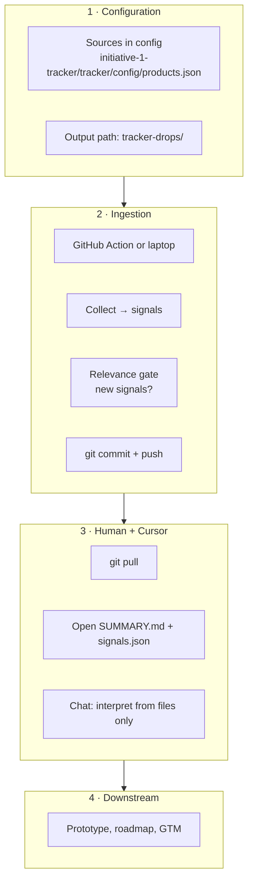

# Tracker Competitors Bot — complete onboarding (one file)

## Is the drop implemented?

**Yes.** In this repository you get:

- **`npm run drop`** → runs **`initiative-1-tracker/tracker/scripts/publish-drop.js`**: collects public signals, then writes **`tracker-drops/<run-id>/signals.json`**, **`SUMMARY.md`**, **`manifest.json`** when there are **new** signals this run (or when **`TRACKER_DROP_FORCE=1`**).
- **GitHub Actions** workflow **`.github/workflows/tracker-drop.yml`** can run the same publish path on a schedule or manually.

If **`npm run`** does not list **`drop`**, you are on an **old branch** or wrong folder — see **Part 5.0** and the **branch** row in the sponsor table below.

---

**Use this as the single handoff document:** how the bot works, **one Git clone**, manager vs runner, CI / Slack, Cursor, and **optional** Entrata (second repo — skip at first).

**Default assumption in this guide:** you **do not** already have the tracker repository on your computer.

**Repositories:** you **only clone one repo** to use the tracker: **this** project (**Tracker Competitors Bot**). A **second** clone (Entrata monolith) appears only in **Part 6** if your sponsor asks you to wire app inventory — **not** required to read drops or run **`npm run drop`**. **Managers** (read and interpret drops) and **runners** (run `npm` / CI) both get the code the same way first: **`git clone`** in **Part 3**. Do not assume a particular path (for example another person’s **Desktop** folder)—**your** project directory only exists after **you** clone into a location **you** choose.

After you clone, this file also lives at the **repo root** — you can **`@TRACKER-EXTERNAL-ONBOARDING.md`** in Cursor from the open folder.

---

## Starting from zero (read first)

**This markdown is not the codebase.** Most people start with **only** `TRACKER-EXTERNAL-ONBOARDING.md` (email, Slack, download, or a small folder that contains nothing else). That includes **managers**: you do **not** need a pre-created “Tracker Competitors Bot” folder (or any tracker folder) on your machine until **you** run **`git clone`**. A copy of this guide sitting in **Downloads** or on the **Desktop** is still **not** the repo.

Until you **clone** with the **HTTPS or SSH URL** from the [Sponsor](#sponsor-one-clone-url--branch) table, you **do not** have:

- `initiative-1-tracker/` — no **`npm run demo`**, **`npm run drop`**, or config on disk yet  
- `tracker-drops/` — no **`SUMMARY.md`** or **`signals.json`** to open yet (those paths exist **inside** the clone after it exists and after drops are produced)

**What to do:** complete **Part 3 — Clone the repo**, then **File → Open Folder…** → the **directory `git clone` created** (the folder that contains `README.md` and `initiative-1-tracker/`). Stop opening “only this handout file” as your project root once the clone exists—use the **clone** as your Cursor folder for **Part 4** (manager) and optional **Part 5** (runner).

---

## Sponsor: one clone URL + branch

**Fill this table before sending.** New users clone **only this repository** (not Entrata unless Part 6).

| Field | Sponsor fills in |
|-------|------------------|
| **HTTPS clone URL** | `https://github.com/<ORG>/<REPO>.git` |
| **SSH clone URL** (only if your org uses SSH) | `git@github.com:<ORG>/<REPO>.git` |
| **Branch to `checkout` after clone** | Name the branch that has **`npm run drop`** and **`scripts/publish-drop.js`** (e.g. **`agent/P1.1`**, or **`main`** after merge). Users run **`git checkout <this-branch>`** — **do not** assume `main` unless you confirm it has the drop scripts. |
| **Who to ask for access** | Name / IT ticket |

Forks: replace URLs with the fork’s clone URL; branch row still applies.

### How this file usually arrives (sponsors read this)

| How you send it | What the user gets | Do they need to make a folder? |
|-----------------|-------------------|--------------------------------|
| **Link to GitHub** (raw or “Download” on the file) | Usually **one downloaded `.md`** in **Downloads** | **No.** Cursor: **File → Open File…** picks the file as-is. Optional: move it into any folder if they prefer **Open Folder…** on a directory. |
| **Email / Slack attachment** (single file) | Same — **one file** on disk | **No** folder required to read it. |
| **Zip of a small folder** (e.g. zip `tracker-handoff/` containing this `.md`) | After **double‑click unzip**, they get a **folder** automatically | **No** manual step; they can **Open Folder…** on that folder. *You* create the zip once: put this file in a folder, compress the folder, attach the zip. |
| **`git clone` the repo** | **Whole project folder**; this guide is at **repo root** | **No.** Clone creates the folder; they **Open Folder…** on the clone. |

There is **no** standard way to make a **single attachment** “download as a folder” without a **zip** or **git clone**. Easiest “folder experience” without the full repo: **zip a folder** that only contains **`TRACKER-EXTERNAL-ONBOARDING.md`** — and remind them that **zip alone still does not include the tracker code**; they must **clone** per **Part 3**.

---

## Part 0 — Recommended first-time flow (open this file, then clone)

Many people find it easier to **read the guide first**, then get the code. That order is fine.

### What you have vs. what you need

| Situation | What’s on disk | What to do |
|-----------|----------------|------------|
| **Guide only** | Just this `.md` file (or a folder with only this file) | You **cannot** open **`tracker-drops/`** or run **`npm`** until you **clone** (Part 3). Paste the sponsor’s **clone URL** there—**nowhere else** creates the repo. |
| **After `git clone`** | A **new folder you chose** (e.g. `~/Projects/<REPO-NAME>/`) with `README.md`, `initiative-1-tracker/`, `tracker-drops/`, `.github/` | **File → Open Folder…** → that **clone**. Then **Part 4** if you are a **manager**; add **Part 5** if you are also a **runner**. |

### Manager on a laptop with no tracker folder yet

1. Get the **clone URL** and **branch** from the [Sponsor](#sponsor-one-clone-url--branch) table.  
2. Follow **Part 3** in Terminal (`git clone` → `cd` into the folder **Git just created**).  
3. In Cursor: **File → Open Folder…** → that **same clone** (not the folder that only had this `.md`).  
4. Follow **Part 4** — **`git pull`**, then **`tracker-drops/…`**. You do **not** need Node for this path if you only read drops and use Chat.  
5. Optional: try **Part 5.2** (`npm run demo`) if you want to see sample output; that needs **Node** and `cd` into **`initiative-1-tracker/tracker`** inside **your** clone.

### Steps (every new joiner)

1. **Receive** this markdown file (and the filled-in table above) from your sponsor.  
2. **Open Cursor** → **File → Open File…** → select **`TRACKER-EXTERNAL-ONBOARDING.md`** (from Downloads, email attachment, etc.).  
3. **Skim** Parts 1–2 so you know what the bot does and what you will clone.  
4. **Clone** the repository using **Part 3** (Terminal — this file does not run `git clone` for you). **Do not skip this** — it is the only way to get **`tracker-drops/`**, **`npm run demo`**, or **`npm run drop`** on your machine.  
5. **File → Open Folder…** in Cursor → choose the **folder created by clone** (contains `README.md` and `initiative-1-tracker/`). Its path is **yours** (e.g. `~/Projects/...`), not a teammate’s Desktop.  
6. Continue with **Part 4** (manager) and/or **Part 5** (runner). Optional: Chat with **`@TRACKER-EXTERNAL-ONBOARDING.md`** using the copy **at repo root** inside the clone.

**Why clone?** The tracker’s **evidence** (`tracker-drops/…`), **config**, and **scripts** live in the repo. This guide is instructions only.

### First session: manager then optional runner (recommended)

After **Part 3** and opening the **cloned** folder—not a folder that only contained this guide:

1. **Manager (quick):** **Part 4.1–4.3** — **`git pull`**, then **`tracker-drops/.latest-drop-id`** → **`tracker-drops/<run-id>/SUMMARY.md`** (and **`signals.json`** if needed). If there is no run folder yet—only **`tracker-drops/README.md`**—see **Part 4.2** *Empty?*; ask a runner for a drop or run **Part 5.3** yourself.  
2. **Runner (quick):** **Part 5.1–5.2** — `cd` to **`<your-clone>/initiative-1-tracker/tracker`**, **`npm install`**, **`npm run demo`** (sample data; confirms the app runs).  
3. **Optional:** **`npm run drop -- --days 7`** (Part 5.3), then repeat the **manager** steps on new files; use **`TRACKER_DROP_FORCE=1`** if the run skipped writing a folder because there were zero new signals (Part 5.3).

---

## Part 1 — What the bot does (short)

- Collects **public** competitor signals (RSS, marketing pages, careers, etc.) from URLs in config.  
- Stores and prunes signals under `initiative-1-tracker/tracker/data/` during collect.  
- When a run adds **new** signal rows (relevance gate), it can write **`tracker-drops/<run-id>/`** with **`SUMMARY.md`**, **`signals.json`**, **`manifest.json`**, and updates **`tracker-drops/.latest-drop-id`**.  
- **Managers** `git pull`, read the drop in **Cursor**, interpret in Chat/Composer, then produce a **prototype / memo / battlecard** (no required `localhost:3000` dashboard).  
- **Runners** run **`npm run drop`** locally and/or rely on **GitHub Actions** to commit/push.

### Diagram — pipeline



### Three jobs (same idea always)

| Job | What |
|-----|------|
| **Collect** | Fetch public sources; normalize; **no** org LLM required here. |
| **Interpret** | Human + **Cursor** on committed files (SUMMARY, signals). |
| **Durable record** | **Git commit** on the agreed branch = source of truth for “what we knew this run.” |

---

## Part 2 — What lives where (after clone)

| Path | Purpose |
|------|---------|
| **`tracker-drops/<run-id>/`** | Evidence for managers: **`SUMMARY.md`** first, then **`signals.json`**. |
| **`tracker-drops/.latest-drop-id`** | One line = newest run id. |
| **`initiative-1-tracker/tracker/`** | Node app: **`npm run collect`**, **`npm run drop`**, **`npm run demo`**. |
| **`initiative-1-tracker/tracker/config/products.json`** | Products, competitors, **source URLs** (blog, pricing, careers, …). |
| **`initiative-1-tracker/tracker/config/our-state.json`** | Our delivery state per dimension (for gap copy). |
| **`.github/workflows/tracker-drop.yml`** | Scheduled / manual **Tracker drop** workflow. |

**Never commit:** API keys, private URLs, PII. Use **Settings → Secrets** on GitHub for CI.

---

## Part 3 — Clone the repo (Git + Cursor)

**Prereqs:** [Git](https://git-scm.com/). **Runners** also need [Node.js 18+](https://nodejs.org/).

### 3.0 No folder on your machine until you clone

You should **not** already have the repository unless you cloned it yourself before. **Do not** look for a folder on someone else’s **Desktop** or a shared path—**`git clone`** creates **your** copy wherever **you** run it. After clone, the new directory name is usually the **repo name** (examples below use `Tracker-Competitors-Bot`; your org’s name may differ). Use **`pwd`** (macOS/Linux) or check the path shown after `cd` so you know where to point **File → Open Folder…** in Cursor.

### 3.1 Terminal — clone **this** repo only

Pick a parent folder (`~/Projects`, `~/Desktop`, etc.):

```bash
cd ~/Projects
git clone <PASTE-HTTPS-URL-FROM-SPONSOR-TABLE>
cd <REPO-FOLDER-NAME>    # folder Git created; name matches repo (e.g. Tracker-Competitors-Bot)
git checkout <BRANCH-FROM-SPONSOR-TABLE>
git pull origin <BRANCH-FROM-SPONSOR-TABLE>
```

Use the **SSH** URL from the sponsor table instead of HTTPS only if they gave you one.

### 3.2 Open in Cursor

**File → Open Folder…** → select the **folder you just cloned** (e.g. `Tracker-Competitors-Bot`, or whatever name appears after `git clone`).

**Other options:** **GitHub Desktop** → Clone → paste URL → choose parent folder — GitHub Desktop creates the repo folder; then **Open Folder…** on **that** directory in Cursor.

---

## Part 4 — Manager path

**Assumption:** you completed **Part 3** and opened the **cloned repository** (not a folder that only contains this handout `.md`). You need **Git**, not necessarily Node.

### 4.1 Update the clone

In Terminal, **`cd`** to **your** clone—the directory that contains `README.md` (same path you used for **File → Open Folder…**):

```bash
cd /path/to/<YOUR-CLONE-OF-REPO>
git fetch origin
git pull origin <BRANCH>
```

Use the **same branch** from the sponsor table (the one you **`git checkout`** in Part 3).

### 4.2 Find the latest drop

1. Open **`tracker-drops/.latest-drop-id`** — copy the run id.  
2. Open **`tracker-drops/<run-id>/SUMMARY.md`**.  
3. Use **`signals.json`** in the same folder for raw excerpts / URLs.

**Empty?** If there is no run folder (only `README.md` under `tracker-drops/`), no drop was committed for that period — usually **no new signals** this run. Ask a runner to trigger a drop or use `TRACKER_DROP_FORCE=1` for a training run (Part 5).

### 4.3 Analyze in Cursor

1. Attach **`SUMMARY.md`** (and **`signals.json`** if needed) in **Chat / Composer** (`@` files).  
2. Example prompt:

   *“Using only the attached drop files, summarize competitor moves, cite dates and sources, list gaps vs our products, and suggest three response themes — no speculation beyond the files.”*

3. **Rule of thumb:** interpret from **committed evidence** only unless your org explicitly allows live web in the same thread.

### 4.4 Prototype / deliverable

Produce your artifact where the team expects (Product OS, slides, doc). No local web server required.

---

## Part 5 — Runner path

### 5.0 Terminal: use the tracker app folder first

Integrated terminals usually open in the **workspace root** (e.g. a parent folder like **Tracker DEMO**), not in the tracker code. **Before** `npm run drop` or `npm run demo`, change directory to the Node app:

```bash
cd /path/to/<YOUR-CLONE-OF-REPO>/initiative-1-tracker/tracker
```

From a **multi-folder** workspace, that path is often **`Tracker-Competitors-Bot/initiative-1-tracker/tracker`** relative to the parent folder. Shortcut: in the Explorer, **right‑click** the **`tracker`** folder (the one that contains **`package.json`** and **`index.js`**) → **Open in Integrated Terminal**.

Sanity check — **`drop`** must appear in the list:

```bash
npm run
```

If you see **`Missing script: "drop"`**, you are in the **wrong directory** or on a **Git branch** whose `package.json` does not define **`drop`** yet (see Part 7 — *not* the same as “no new signals this week”).

- **`npm run drop`** needs **`scripts/publish-drop.js`** and **`drop`** in **`package.json`**. If missing, you are on the wrong **branch** — **`git checkout`** the branch your sponsor put in the table (not necessarily `main`).

### 5.1 One-time setup

```bash
cd /path/to/<YOUR-CLONE-OF-REPO>/initiative-1-tracker/tracker
npm install
```

Optional: copy **`.env.example`** → **`.env`** if your team documented keys (many public-source runs work without it).

### 5.2 Sanity check (sample data, does not write Git drops)

```bash
npm run demo
```

### 5.3 Collect + publish drop

```bash
npm run drop -- --days 7
```

- **No new folder?** If **zero new signals**, the script **skips** writing `tracker-drops/<run>/` (by design).  
- **Training / demo only:**

```bash
TRACKER_DROP_FORCE=1 npm run drop -- --days 7
```

### 5.4 Commit and push (manual)

From **repo root**:

```bash
cd /path/to/<YOUR-CLONE-OF-REPO>
git add tracker-drops
git status
git commit -m "tracker drop: manual run"
git push origin <BRANCH>
```

### 5.5 GitHub Actions (“the bot”)

1. Repo → **Actions** → **Tracker drop** → **Run workflow** (manual), or wait for **schedule** (default **every 15 minutes** UTC in `.github/workflows/tracker-drop.yml` — your org may change this).  
2. Workflow runs **`publish-drop.js`** → **`tracker-drops/`** only gets a **new** run when **`newCount > 0`** (unless you add `TRACKER_DROP_FORCE` in the workflow for debugging).  
3. If **`git add tracker-drops`** has changes, the job **commits and pushes** to the branch the workflow runs on.

**Branch protection:** If pushes to `main` are blocked, adjust policy with your admin (dedicated branch, PAT, or PR flow) — same constraints as any CI bot.

**Secrets (repository):**

| Secret | Required? | Purpose |
|--------|-----------|---------|
| *(default)* `GITHUB_TOKEN` | Yes (Actions) | Push to **this** repo when `permissions: contents: write`. |
| `SLACK_WEBHOOK_URL` | No | Incoming Webhook; if unset, Slack step is skipped. |

**Slack (optional):** Create Incoming Webhook in Slack → add **`SLACK_WEBHOOK_URL`** under **Settings → Secrets and variables → Actions**. After a successful push, **`slack-drop-notify.js`** can post a short summary + commit link. Admin approval may be required in locked-down workspaces.

**Second remote:** Only if drops must land in a **different** repo than this code — needs a PAT secret and a custom push step; see **`initiative-1-tracker/docs/TRACKER-DROP-CI.md`** for the pattern.

---

## Part 6 — Optional: second repository (Entrata) — **skip until your sponsor asks**

This is **not** part of “clone the tracker.” **Only** add this after you are comfortable with Parts 3–5.

Use this when you want Chat to relate drops to **your shipped apps** (no copying proprietary source into this repo).

1. **Separately** clone Entrata (or monolith) per **internal** process — keep it in its normal Git home.  
2. **File → Add Folder to Workspace…** (or **Open Workspace from File…**).  
3. Add **two roots:** this **Tracker** repo + **Entrata** parent folder (the tree that contains `Applications/`, etc.).  
4. Copy **`entrata-plus-tracker.code-workspace.example`** → **`entrata-plus-tracker.code-workspace`**, edit paths, open the workspace in Cursor.  
5. For collect features that read the monolith, set **`ENTRATA_MONO_ROOT`** in the shell you use for **`npm run collect`** / **`npm run drop`** (path to `entrata-core` or equivalent).  
6. **`initiative-1-tracker/tracker/config/app-inventory.json`** ties products to app paths — see **`initiative-1-tracker/docs/ENTRATA-CODE-IN-CURSOR.md`** for full detail.

---

## Part 7 — Troubleshooting

| Symptom | What to try |
|---------|-------------|
| **`npm error Missing script: "drop"`** | The shell is **not** in **`initiative-1-tracker/tracker`**, or your checkout’s **`package.json`** has no **`drop`** script (e.g. older **`main`**). **Not** “zero signals.” Fix **`cd`**, run **`npm run`** to confirm **`drop`** exists, or **`git checkout`** / **`git pull`** the branch your team uses for the full tracker (see **`scripts`** in `package.json`). |
| No new folder under **`tracker-drops/`** after **`npm run drop`** succeeds | Only then: often **no new signals** in the window; use **`TRACKER_DROP_FORCE=1`** for a demo; or widen **`--days`**. |
| **`npm run drop`** very slow | Expected — many HTTP requests during collect. |
| **Actions** never commits | No change under `tracker-drops/`; workflow disabled; or branch protection — see Part 5.5. |
| **`git clone`** fails | VPN, URL typo, or no GitHub access — contact sponsor / IT. |
| **`git push`** denied | Need write access or use a PR branch per policy. |
| **`npm install`** errors | Use **Node 18+**; run from **`initiative-1-tracker/tracker`**. |

---

## Part 8 — Deeper reference (inside the clone)

Use these when you need full detail beyond this onboarding:

| Topic | Path in repo |
|-------|----------------|
| Full architecture + extra diagrams | `initiative-1-tracker/docs/TRACKER-FLOW-END-TO-END.md` |
| CI, cron, Slack checklist, second remote | `initiative-1-tracker/docs/TRACKER-DROP-CI.md` |
| Source URLs and collect behavior | `initiative-1-tracker/docs/COMPETITOR-DATA-PULL-REFERENCE.md` |
| How gaps read in the product (L1/L2) | `initiative-1-tracker/docs/COMPETITIVE-INTEL-PRESENTATION.md` |
| Rule-based interpretation in code | `initiative-1-tracker/docs/STRATEGIC-INTERPRETATION.md` |
| Multi-root + `ENTRATA_MONO_ROOT` | `initiative-1-tracker/docs/ENTRATA-CODE-IN-CURSOR.md` |
| Docs index | `initiative-1-tracker/docs/README.md` |

**Legacy local HTML report (dev only):** `npm run serve` under `initiative-1-tracker/tracker` — **not** the default manager path.

---

## Version note

When URLs, workflow names, or folder layout change, **update this file** and re-share it. Keeping one **complete** onboarding here avoids “which doc was the right one?” for new joiners.
