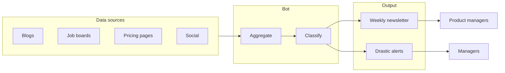
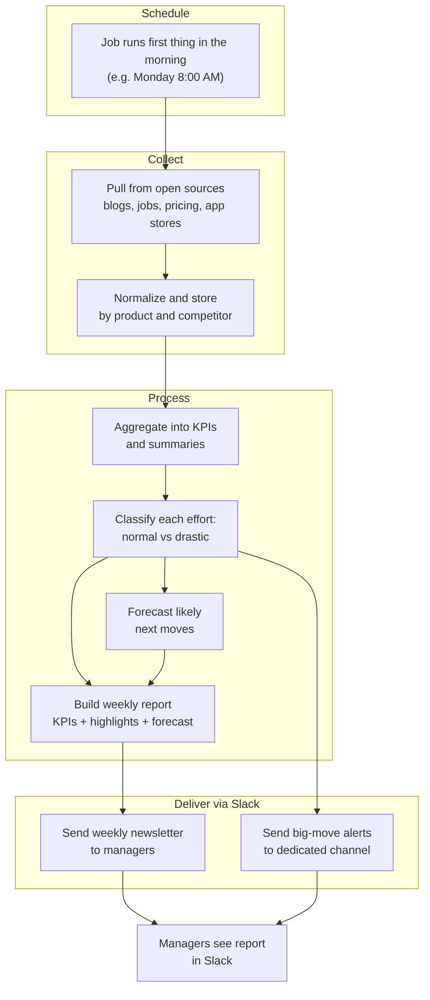

# Tracker Competitors Bot — Flow graphs

Graphs from the [PRD](PRD.md) for the bot process. You can view these in any Markdown viewer that supports Mermaid (e.g. GitHub, Notion, Cursor preview), or paste the code into [Mermaid Live](https://mermaid.live) to export as PNG/SVG.

---

## 1. High-level flow (sources → bot → output)

---

## 2. Detailed process flow (schedule → collect → process → Slack)

---

**Export as image (PNG/SVG):**  
- Copy the contents of a code block above into [Mermaid Live Editor](https://mermaid.live), then use **Actions → Export** to download PNG or SVG.  
- Or use the standalone Mermaid source file **`flow-process.mmd`** in this folder: open it, copy all, paste into Mermaid Live, and export the detailed process flow.
