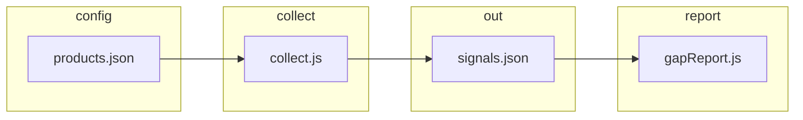

# Competitor data pull — full reference (paste into chat for suggestions)

**Purpose:** Architecture + config reference for **everything that fetches competitor information**. For **verbatim source code** in one paste, run from repo root: `node scripts/export-competitor-pull-context.js` (includes full `collect.js`). You can also copy sections **## 0–6** and **## 8–10** of this file into another chat, then attach the exporter output.

**Repo paths:** `initiative-1-tracker/tracker/` — main code. **Runtime:** Node 18+ (`fetch` available).

---

## 0. One-paragraph summary

For each **product** × **competitor**, `collect(competitorId, productId, days, session)` loads URLs from `config/products.json` (`sources.<competitorId>`) with optional **environment overrides**, fetches **RSS/Atom** (blog, press, changelog, YouTube channel feed), **HTML pages** (pricing, features, careers), optional **YouTube Data API** (**`search.list`** + **`videos.list`** when `youtube_discovery_queries` + `YOUTUBE_DATA_API_KEY` are set; **`commentThreads.list`** when `youtube_comment_video_ids` is set), optional **G2** HTML excerpt probe, normalizes into **signal** objects, filters to the last **`days`**, merges into `data/signals.json` (dedupe by date + competitor + product + type + snippet prefix), then **prunes** rows older than that window. The UI triggers this via **`POST /api/collect?days=N`**. **`session.youtubeDiscovery`** caches search results **once per competitor per batch** so API quota is not multiplied by the number of products. **No video transcripts** in-repo yet.

---

## 1. Data flow (high level)



| Step | What runs | Output |
|------|-----------|--------|
| Config | `loadConfig()` reads `config/products.json` | `products[]`, `competitors[]`, `sources{}` |
| Collect loop | `server.js` or `index.js`: for each product × competitor → `collect(...)` | In-memory signals |
| Filter | `filterLastDays(signals, days)` | Signals with `date >= cutoff` |
| Persist | `writeSignals` merge + dedupe; `pruneSignalsToRetentionDays` | `data/signals.json` |
| Report | `getSignals` + `buildGapReport` | Gaps for first product in config only (`reportApi.js`) |

---

## 2. Signal shape (each stored row)

Typical fields produced by `collect.js`:

| Field | Meaning |
|-------|---------|
| `date` | `YYYY-MM-DD` — from RSS/Atom pub date, or **today** for static HTML pages |
| `source` | `blog` \| `press` \| `changelog` \| `youtube` \| `pricing_page` \| `features_page` \| `careers` |
| `competitor_id` | e.g. `eliseai` |
| `product_id` | e.g. `prospect-portal` |
| `type` | `blog` \| `press` \| `changelog` \| `youtube` \| `pricing` \| `features` \| `job` |
| `snippet` | Main text shown in gaps (max ~600 for RSS path) |
| `headline` | RSS title or og:title for pages |
| `source_url` | Item link or page URL |
| `evidence_snippet` | Richer excerpt when article page was fetched |

**Dedupe key** (merge only): `` `${date}|${competitor_id}|${product_id}|${type}|${snippet.slice(0,80)}` ``

---

## 3. Environment variable overrides

Competitor id `funnel-leasing` → env suffix `FUNNEL_LEASING` (uppercase, hyphens → underscores).

| Env var | Maps to config field |
|---------|----------------------|
| `TRACKER_FEED_URL_<ID>` | `blog` |
| `TRACKER_PRESS_URL_<ID>` | `press` / `news` |
| `TRACKER_CHANGELOG_URL_<ID>` | `changelog` |
| `TRACKER_YOUTUBE_RSS_<ID>` | `youtube_rss` / `youtube` |

**Note:** `pricing_url`, `features_url`, `careers_url` are **not** overridden by env in current code — only from JSON.

---

## 4. `config/products.json` — structure + current sources (copy for chat)

- **`sources.<competitor_id>`** keys: `blog`, `press`, `changelog`, `youtube_rss` (optional), `pricing_url`, `features_url`, `careers_url`. Empty string = skip that source.
- **`products`**: 11 L2L products; collect runs **once per product per competitor** (same URLs, different `product_id` on each signal).
- **`competitors`**: EliseAI, Funnel Leasing, LeaseHawk, Anyone Home, Jonah Digital.

Snapshot (verify in repo for edits):

```json
{
  "sources": {
    "eliseai": {
      "blog": "https://eliseai.com/blog/feed/",
      "press": "",
      "changelog": "",
      "pricing_url": "https://eliseai.com/pricing/",
      "features_url": "https://eliseai.com/",
      "careers_url": "https://eliseai.com/careers/"
    },
    "funnel-leasing": {
      "blog": "", "press": "", "changelog": "",
      "youtube_rss": "",
      "pricing_url": "https://funnelleasing.com/pricing/",
      "features_url": "https://funnelleasing.com/",
      "careers_url": "https://funnelleasing.com/careers/"
    },
    "leasehawk": {
      "blog": "", "press": "", "changelog": "",
      "youtube_rss": "",
      "pricing_url": "https://leasehawk.com/",
      "features_url": "https://leasehawk.com/",
      "careers_url": "https://leasehawk.com/careers/"
    },
    "anyone-home": {
      "blog": "", "press": "", "changelog": "",
      "pricing_url": "https://anyonehome.com/",
      "features_url": "https://anyonehome.com/",
      "careers_url": "https://anyonehome.com/careers/"
    },
    "jonah-digital": {
      "blog": "", "press": "", "changelog": "",
      "pricing_url": "https://jonahdigital.com/",
      "features_url": "https://jonahdigital.com/",
      "careers_url": "https://jonahdigital.com/careers/"
    }
  }
}
```

---

## 5. Orchestration code

### `server.js` — HTTP collect (UI “Refresh data”)

- `POST /api/collect?days=N` — `N` default 7, max 90.
- Nested loops: `config.products` × `config.competitors` → `collect(id, product.id, retentionDays)` → `writeSignals` → `pruneSignalsToRetentionDays(retentionDays)`.
- Writes `data/collect-meta.json` with `last_collected_at`, `signals_stored`, `retention_days`, `signals_kept`, `signals_removed_retention`.

### `index.js` — CLI

- `node index.js collect` — same loops; optional `--days 14`.
- After loop: `pruneSignalsToRetentionDays(collectDays)`.

### `lib/loadConfig.js` (full)

```javascript
const path = require('path');
const fs = require('fs');

const CONFIG_PATH = path.join(__dirname, '..', 'config', 'products.json');

function loadConfig() {
  const raw = fs.readFileSync(CONFIG_PATH, 'utf8');
  return JSON.parse(raw);
}

module.exports = { loadConfig };
```

---

## 6. `lib/storage.js` (full)

```javascript
const path = require('path');
const fs = require('fs');

const DATA_DIR = path.join(__dirname, '..', 'data');
const SIGNALS_FILE = path.join(DATA_DIR, 'signals.json');

function ensureDataDir() {
  if (!fs.existsSync(DATA_DIR)) fs.mkdirSync(DATA_DIR, { recursive: true });
}

/** YYYY-MM-DD cutoff for "keep signals on or after this date" (same logic as reportApi getPeriodDays). */
function retentionCutoffDate(days) {
  const d = Math.min(365, Math.max(1, parseInt(days, 10) || 7));
  const start = new Date();
  start.setDate(start.getDate() - d);
  return start.toISOString().slice(0, 10);
}

/**
 * Drop stored signals older than the rolling window (inclusive of cutoff date).
 * @returns {{ kept: number, removed: number }}
 */
function pruneSignalsToRetentionDays(days) {
  ensureDataDir();
  if (!fs.existsSync(SIGNALS_FILE)) return { kept: 0, removed: 0 };
  const cutoff = retentionCutoffDate(days);
  let list = [];
  try {
    list = JSON.parse(fs.readFileSync(SIGNALS_FILE, 'utf8'));
  } catch (_) {
    return { kept: 0, removed: 0 };
  }
  if (!Array.isArray(list)) return { kept: 0, removed: 0 };
  const before = list.length;
  const keptList = list.filter((s) => s && typeof s.date === 'string' && s.date >= cutoff);
  fs.writeFileSync(SIGNALS_FILE, JSON.stringify(keptList, null, 2), 'utf8');
  return { kept: keptList.length, removed: before - keptList.length };
}

/**
 * Append or replace signals in storage. If replace is true, overwrites; else merges by (date, competitor_id, product_id, type, snippet) and writes.
 * @returns {{ total: number, added: number }}
 */
function writeSignals(signals, replace = false) {
  ensureDataDir();
  let existing = [];
  if (!replace && fs.existsSync(SIGNALS_FILE)) {
    try {
      existing = JSON.parse(fs.readFileSync(SIGNALS_FILE, 'utf8'));
    } catch (_) {}
  }
  if (!Array.isArray(existing)) existing = [];

  let added = 0;
  if (replace) {
    existing = Array.isArray(signals) ? signals.slice() : [];
    added = existing.length;
  } else {
    const key = (s) => `${s.date}|${s.competitor_id}|${s.product_id}|${s.type}|${(s.snippet || '').slice(0, 80)}`;
    const seen = new Set(existing.map(key));
    for (const s of signals) {
      if (!seen.has(key(s))) {
        existing.push(s);
        seen.add(key(s));
        added++;
      }
    }
  }
  fs.writeFileSync(SIGNALS_FILE, JSON.stringify(existing, null, 2), 'utf8');
  return { total: existing.length, added };
}

/**
 * Read signals from storage for productId between periodStart and periodEnd (inclusive, YYYY-MM-DD).
 */
function getSignals(productId, periodStart, periodEnd) {
  if (!fs.existsSync(SIGNALS_FILE)) return [];
  const raw = fs.readFileSync(SIGNALS_FILE, 'utf8');
  let list = [];
  try {
    list = JSON.parse(raw);
  } catch (_) {
    return [];
  }
  return list.filter(
    (s) => s.product_id === productId && s.date >= periodStart && s.date <= periodEnd
  );
}

module.exports = { writeSignals, getSignals, pruneSignalsToRetentionDays, retentionCutoffDate, SIGNALS_FILE };
```

---

## 7. `lib/collect.js` (canonical source)

The **full** RSS/HTML fetch implementation is **only** in the repo (not duplicated here — avoids stale or broken copies):

`initiative-1-tracker/tracker/lib/collect.js`

**Exports:** `collect`, `filterLastDays`, `getSourceUrls`, `isValidPublicUrl`.

### One-shot export for external AI chats

From the **repository root**:

```bash
node scripts/export-competitor-pull-context.js
```

That prints, in order: this doc → `products.json` → `loadConfig.js` → `storage.js` → **full `collect.js`** → truncated `server.js`, `index.js`, `gapReport.js`. Redirect to a file if needed:

```bash
node scripts/export-competitor-pull-context.js > /tmp/tracker-pull-context.txt
```


---

## 8. Downstream: `gapReport.js` (how signal `type` maps to dimensions)

- `cleanSnippet()` strips demo/nav boilerplate; prefers fact-like content.
- `inferDimension(signal)` maps `type` → `{ dimension, ourKey }` for `our-state.json` lookup, e.g.:
  - `youtube` / `video` / `press` / `news` / some `job` → **positioning**
  - `changelog` / `features` / most `blog` → **features**
  - pricing-ish → **messaging**
- Full file: `tracker/lib/gapReport.js`.

---

## 9. Not implemented (planned / docs only)

- **YouTube discovery** via Data API search (`search.list`) — see `docs/YOUTUBE-CHANNELS.md`.
- **Transcripts** for video.
- **Per-product competitor focus** (same URLs repeated for all 11 products).
- **Report** currently uses **first product** in `products.json` only (`reportApi.js`).

---

## 10. Suggested prompt to paste after this doc

> You are reviewing our competitor intelligence collector. Using the reference above, suggest: (1) highest-ROI new public sources we could add with minimal code, (2) risks (ToS, rate limits, brittle HTML), (3) structural improvements to reduce duplicate signals across 11 products, (4) whether RSS regex parsing should be replaced and with what. Be specific to multifamily / PropTech competitors.

---

*Update `products.json` snapshot in §4 when sources change; `collect.js` is always read from disk / exporter output.*
