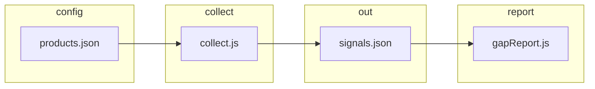

# Competitor data pull — full reference (paste into chat for suggestions)

**Purpose:** Architecture + config reference for **everything that fetches competitor information**. **Source-by-source detail:** §2.1 (lanes), §2.2 (APIs), §2.3 (competitor×lane matrix). For **verbatim source code** in one paste, run from repo root: `node scripts/export-competitor-pull-context.js` (includes full `collect.js`). You can also copy sections **## 0–6** and **## 8–10** of this file into another chat, then attach the exporter output.

**Per-competitor “where is the truth?”** — maintain a short [SURFACE-INVENTORY.md](./SURFACE-INVENTORY.md) (trust tiers + cadence) alongside `products.json` URLs.

**Repo paths:** `initiative-1-tracker/tracker/` — main code. **Runtime:** Node 18+ (`fetch` available).

---

## 0. One-paragraph summary

For each **product** × **competitor**, `collect(competitorId, productId, days, session)` loads URLs from `config/products.json` (`sources.<competitorId>`) with optional **environment overrides**, fetches **RSS/Atom** (blog, press, changelog, YouTube channel feed), **HTML pages** (pricing, features, careers, **docs_url** — same feature extractor as `features_url`), optional **YouTube Data API** (**`search.list`** + **`videos.list`** when `youtube_discovery_queries` + `YOUTUBE_DATA_API_KEY` are set; **`commentThreads.list`** when `youtube_comment_video_ids` is set), optional **G2** HTML excerpt probe, normalizes into **signal** objects, filters to the last **`days`**, merges into `data/signals.json` (dedupe by date + competitor + product + type + snippet prefix), then **prunes** rows older than that window. The UI triggers this via **`POST /api/collect?days=N`**. **`session.youtubeDiscovery`** caches search results **once per competitor per batch** so API quota is not multiplied by the number of products. **No video transcripts** in-repo yet.

---

## 1. Data flow (high level)



| Step | What runs | Output |
|------|-----------|--------|
| Config | `loadConfig()` reads `config/products.json` | `products[]`, `competitors[]`, `sources{}` |
| Collect loop | `server.js` or `index.js`: for each product × competitor → `collect(...)` | In-memory signals |
| Filter | `filterLastDays(signals, days)` | Signals with `date >= cutoff` |
| Persist | `writeSignals` merge + dedupe; `pruneSignalsToRetentionDays` | `data/signals.json` |
| Report | `getSignals` + `buildGapReport` | Gaps for first product in config only (`reportApi.js`) |

---

## 2. Signal shape (each stored row)

Typical fields produced by `collect.js`:

| Field | Meaning |
|-------|---------|
| `date` | `YYYY-MM-DD` — from RSS/Atom pub date, or **today** for static HTML pages |
| `source` | `blog` \| `press` \| `changelog` \| `youtube` \| `pricing_page` \| `features_page` \| `careers` \| `youtube_search` \| `youtube_comments` \| `g2_reviews` |
| `competitor_id` | e.g. `eliseai` |
| `product_id` | e.g. `prospect-portal` |
| `type` | `blog` \| `press` \| `changelog` \| `youtube` \| `pricing` \| `features` \| `job` \| `review_youtube` \| `review_g2` |
| `snippet` | Main text shown in gaps (max ~600 for RSS path) |
| `headline` | RSS title or og:title for pages |
| `source_url` | Item link or page URL |
| `evidence_snippet` | Richer excerpt when article page was fetched |

**Dedupe key** (merge only): `` `${date}|${competitor_id}|${product_id}|${type}|${snippet.slice(0,80)}` ``

**Inside-batch dedupe** (`collect.js`): before return, signals are also deduped on a tighter key (date, competitor, product, type, event_type, source_url, snippet prefix).

---

### 2.1 Source lanes — config key → fetch → `source` / `type`

Each lane is optional; empty string in JSON skips it. Unless noted, data is **public HTTP(S)** only (no auth).

| Config key | Env override (optional) | What runs | Signal `source` | Signal `type` | `date` field |
|------------|-------------------------|-----------|-----------------|---------------|--------------|
| `blog` | `TRACKER_FEED_URL_<ID>` | RSS/Atom parse (`rss-parser`); optional per-item article HTML for evidence | `blog` | `blog` | Item pub date (fallback: today) |
| `press` | `TRACKER_PRESS_URL_<ID>` | Same as blog; use for press/news RSS | `press` | `press` | Item pub date |
| `changelog` | `TRACKER_CHANGELOG_URL_<ID>` | Same as blog | `changelog` | `changelog` | Item pub date |
| `youtube_rss` | `TRACKER_YOUTUBE_RSS_<ID>` | Same RSS path; `sourceType` is forced to **`youtube`** | `youtube` | `youtube` | Item pub date |
| `insights_url` *(Phase 2)* | `TRACKER_INSIGHTS_URL_<ID>` | RSS for editorial articles (Forum / panel recaps, executive interviews) | `insights` | `insights` | Item pub date |
| `media_url` *(Phase 2)* | `TRACKER_MEDIA_URL_<ID>` | RSS for third-party media coverage of the competitor | `media` | `media` | Item pub date |
| `podcast_url` *(Phase 2)* | `TRACKER_PODCAST_URL_<ID>` | RSS for podcast episode metadata (titles, descriptions; not transcripts) | `podcast` | `podcast` | Item pub date |
| `pricing_url` | — *(JSON only)* | Single `GET`; cheerio extracts headings, bullets, price-like tokens | `pricing_page` | `pricing` | **Run day** (snapshot) |
| `features_url` | — | Same HTML pipeline as pricing; keyword / heading heuristics for “feature themes” | `features_page` | `features` | **Run day** |
| `docs_url` | — | **Same code path as `features_url`** (treated as marketing/docs HTML, not an API spec) | `features_page` | `features` | **Run day** |
| `careers_url` | — | HTML; job-title regex scan | `careers` | `job` | **Run day** |
| `youtube_discovery_queries` | — | YouTube Data API: `search.list` + `videos.list` per query; batched **once per competitor** when `session.youtubeDiscovery` is used | `youtube_search` | `review_youtube` | Video publish date (ISO day) |
| `youtube_comment_video_ids` | — | YouTube Data API: `commentThreads.list` per video id | `youtube_comments` | `review_youtube` | **Run day** (so rows stay inside the `--days` window) |
| `g2_reviews_url` | `TRACKER_G2_REVIEWS_URL_<ID>` | HTML `GET` + `g2Scrape` excerpt heuristic *(brittle if G2 is heavy JS)*. Accepts **string** or **string[]** (Phase 2): each URL fetched independently, e.g. main product + sub-product G2 pages. | `g2_reviews` | `review_g2` | **Run day** (or “empty parse” note row) |
| `reviews_url` *(Phase 2)* | `TRACKER_REVIEWS_URL_<ID>` | HTML `GET` + generic excerpt extractor (cheerio with broad selectors) for non-G2 review aggregators (FeaturedCustomers, FitGap, Revyse, SlashDot) | `reviews_other` | `review_other` | **Run day** |
| `case_studies_url` *(Phase B-2)* | `TRACKER_CASE_STUDIES_URL_<ID>` | HTML `GET` + cheerio testimonial-block extractor for own-domain case study / customer story pages (Anyone Home `/customer-stories/`, `/why-anyone-home/`). Accepts **string** or **string[]**. | `case_studies` | `case_study` | **Run day** |
| `articles_url` *(Phase B-2)* | `TRACKER_ARTICLES_URL_<ID>` | HTML `GET` + cheerio article-card extractor for HTML article-index pages without RSS (Webflow / custom-CMS competitors). Accepts **string** or **string[]**. | `articles_index` | `article` | **Run day** |

**HTML caveats:** Pricing, features, docs, and careers signals only see **server-rendered** text in the initial response. Pure client-rendered pages may yield **no** or **thin** signals.

**RSS caveats:** Feed fetch timeouts (15s); failures return zero signals for that lane (no hard fail).

---

### 2.2 Optional APIs and limits

| Requirement | Env / config | Behavior |
|-------------|--------------|----------|
| YouTube search + comments | `YOUTUBE_DATA_API_KEY` | Without the key, `youtube_discovery_queries` and `youtube_comment_video_ids` produce **no** API-based signals. |
| Discovery volume | `youtube_discovery_max_results` (1–15, default 5), `youtube_discovery_max_queries` (1–8, default 4 in code if unset) | Caps per competitor per collect when API is enabled. |
| G2 | `g2_reviews_url` non-empty | May emit a low-confidence row if the scrape finds no static excerpts (see `collect.js` / `g2Scrape`). |

---

### 2.3 Competitor × lane matrix *(current `products.json`)*

Row = competitor `id`. Cell = configured **non-empty** URL or, for YouTube API fields, whether queries / video IDs are set. ✓✓ in the `G2` / `case` / `art` columns = array form (multiple URLs tracked).

| Competitor | blog | press | changelog | yt_rss | insights | media | podcast | reviews | case | art | docs | pricing | features | careers | G2 | YT disc | YT cmt |
|------------|------|-------|-----------|--------|----------|-------|---------|---------|------|-----|------|---------|----------|---------|----|---------|--------|
| `eliseai` | ✓ | — | — | — | — | — | — | — | — | — | ✓ | ✓ | ✓ | ✓ | ✓ | ✓ | — |
| `funnel-leasing` | ✓ | ✓ | — | — | ✓ | ✓ | ✓ | ✓ | — | — | ✓ | ✓ | ✓ | ✓ | ✓✓ | — | — |
| `leasehawk` | — | — | — | — | — | — | — | — | — | — | — | ✓ | ✓ | ✓ | — | — | — |
| `anyone-home` | ✓ | — | ✓ | — | — | — | — | — | ✓✓ | — | — | ✓ | ✓ | — | — | — | — |
| `jonah-digital` | — | — | — | — | — | — | — | — | — | — | ✓ | ✓ | ✓ | ✓ | — | — | — |

Column key: `case` = `case_studies_url`, `art` = `articles_url` (both Phase B-2).

After changing any URL or API-related field, run **collect** (or `npm run drop`) before trusting new rows in `tracker-drops/`. See [SURFACE-INVENTORY.md](./SURFACE-INVENTORY.md) for **trust tier** and cadence notes per surface.

---

## 3. Environment variable overrides

Competitor id `funnel-leasing` → env suffix `FUNNEL_LEASING` (uppercase, hyphens → underscores).

| Env var | Maps to config field |
|---------|----------------------|
| `TRACKER_FEED_URL_<ID>` | `blog` |
| `TRACKER_PRESS_URL_<ID>` | `press` / **`news`** (either key in JSON resolves to the press feed slot) |
| `TRACKER_CHANGELOG_URL_<ID>` | `changelog` |
| `TRACKER_YOUTUBE_RSS_<ID>` | `youtube_rss` / `youtube` |
| `TRACKER_INSIGHTS_URL_<ID>` *(Phase 2)* | `insights_url` |
| `TRACKER_MEDIA_URL_<ID>` *(Phase 2)* | `media_url` |
| `TRACKER_PODCAST_URL_<ID>` *(Phase 2)* | `podcast_url` |
| `TRACKER_REVIEWS_URL_<ID>` *(Phase 2)* | `reviews_url` |
| `TRACKER_G2_REVIEWS_URL_<ID>` *(Phase 2)* | `g2_reviews_url` *(comma- or whitespace-separated for multiple URLs)* |
| `TRACKER_CASE_STUDIES_URL_<ID>` *(Phase B-2)* | `case_studies_url` *(comma- or whitespace-separated for multiple URLs)* |
| `TRACKER_ARTICLES_URL_<ID>` *(Phase B-2)* | `articles_url` *(comma- or whitespace-separated for multiple URLs)* |

**Note:** `pricing_url`, `features_url`, `careers_url`, `docs_url` are **not** overridden by env in current code — only from JSON.

---

## 4. `config/products.json` — structure + current sources (copy for chat)

- **`sources.<competitor_id>`** — all keys are optional except you must use valid JSON:
  - **Feeds (RSS/Atom):** `blog`, `press` (JSON may use **`news`** instead; `getSourceUrls` treats it like `press`), `changelog`, `youtube_rss`, `insights_url`, `media_url`, `podcast_url`.
  - **Single-page HTML:** `pricing_url`, `features_url`, `careers_url`, `docs_url`.
  - **Reviews:** `g2_reviews_url` (string OR string[] — Phase 2 array form for multi-product competitors); `reviews_url` (non-G2 aggregator HTML — FeaturedCustomers, FitGap, Revyse, SlashDot).
  - **HTML lanes (Phase B-2):** `case_studies_url` (string OR string[] — own-domain testimonial / case study pages), `articles_url` (string OR string[] — HTML article-index pages without RSS).
  - **Social API:** `youtube_discovery_queries` (+ optional `youtube_discovery_max_results`, `youtube_discovery_max_queries`); `youtube_comment_video_ids` (array of 11-char video IDs).
  - Empty string, empty array, or omitting a key ⇒ that lane is skipped.
- **`products`**: 11 L2L products; collect runs **once per product per competitor** (same URLs, different `product_id` on each signal). API-heavy lanes (YouTube search) reuse a **per-competitor session cache** so quota is **not** multiplied by 11.
- **`competitors`**: metadata only (name, priority, website, focus); ingestion reads **`sources`** by same `id`.

**Canonical file:** `initiative-1-tracker/tracker/config/products.json`. Snapshot below for quick paste—**diff against disk** if something looks off:

```json
{
  "sources": {
    "eliseai": {
      "blog": "",
      "press": "",
      "changelog": "",
      "docs_url": "https://www.eliseai.com/datalog",
      "pricing_url": "https://eliseai.com/pricing/",
      "features_url": "https://eliseai.com/",
      "careers_url": "https://eliseai.com/careers/",
      "g2_reviews_url": "https://www.g2.com/products/eliseai/reviews",
      "youtube_comment_video_ids": [],
      "youtube_discovery_queries": [
        "EliseAI review multifamily",
        "Elise AI honest review property management"
      ],
      "youtube_discovery_max_results": 5,
      "youtube_discovery_max_queries": 2
    },
    "funnel-leasing": {
      "blog": "https://funnelleasing.com/category/llm/feed/",
      "press": "https://funnelleasing.com/category/press/feed/",
      "changelog": "",
      "insights_url": "https://funnelleasing.com/category/insights/feed/",
      "media_url": "https://funnelleasing.com/category/media/feed/",
      "podcast_url": "https://funnelleasing.com/category/podcast/feed/",
      "reviews_url": "https://www.featuredcustomers.com/vendor/funnel-leasing",
      "g2_reviews_url": [
        "https://www.g2.com/products/funnel-leasing/reviews",
        "https://www.g2.com/products/fenix-ai/reviews"
      ],
      "docs_url": "https://developer.funnelleasing.com/",
      "youtube_rss": "",
      "pricing_url": "https://funnelleasing.com/pricing/",
      "features_url": "https://funnelleasing.com/",
      "careers_url": "https://funnelleasing.com/careers/"
    },
    "leasehawk": {
      "blog": "",
      "press": "",
      "changelog": "",
      "docs_url": "",
      "youtube_rss": "",
      "pricing_url": "https://leasehawk.com/",
      "features_url": "https://leasehawk.com/",
      "careers_url": "https://leasehawk.com/careers/"
    },
    "anyone-home": {
      "blog": "https://www.anyonehome.com/feed/",
      "press": "",
      "changelog": "https://anyonehome-updates.com/feed/",
      "docs_url": "",
      "pricing_url": "https://anyonehome.com/",
      "features_url": "https://anyonehome.com/solutions/",
      "careers_url": "",
      "case_studies_url": [
        "https://anyonehome.com/customer-stories/",
        "https://anyonehome.com/why-anyone-home/"
      ]
    },
    "jonah-digital": {
      "blog": "",
      "press": "",
      "changelog": "",
      "docs_url": "https://jonahdigital.com/articles/",
      "pricing_url": "https://jonahdigital.com/",
      "features_url": "https://jonahdigital.com/",
      "careers_url": "https://jonahdigital.com/careers/"
    }
  }
}
```

---

## 5. Orchestration code

### `server.js` — HTTP collect (UI “Refresh data”)

- `POST /api/collect?days=N` — `N` default 7, max 90.
- Nested loops: `config.products` × `config.competitors` → `collect(id, product.id, retentionDays)` → `writeSignals` → `pruneSignalsToRetentionDays(retentionDays)`.
- Writes `data/collect-meta.json` with `last_collected_at`, `signals_stored`, `retention_days`, `signals_kept`, `signals_removed_retention`.

### `index.js` — CLI

- `node index.js collect` — same loops; optional `--days 14`.
- After loop: `pruneSignalsToRetentionDays(collectDays)`.

### `lib/loadConfig.js` (full)

```javascript
const path = require('path');
const fs = require('fs');

const CONFIG_PATH = path.join(__dirname, '..', 'config', 'products.json');

function loadConfig() {
  const raw = fs.readFileSync(CONFIG_PATH, 'utf8');
  return JSON.parse(raw);
}

module.exports = { loadConfig };
```

---

## 6. `lib/storage.js` (full)

```javascript
const path = require('path');
const fs = require('fs');

const DATA_DIR = path.join(__dirname, '..', 'data');
const SIGNALS_FILE = path.join(DATA_DIR, 'signals.json');

function ensureDataDir() {
  if (!fs.existsSync(DATA_DIR)) fs.mkdirSync(DATA_DIR, { recursive: true });
}

/** YYYY-MM-DD cutoff for "keep signals on or after this date" (same logic as reportApi getPeriodDays). */
function retentionCutoffDate(days) {
  const d = Math.min(365, Math.max(1, parseInt(days, 10) || 7));
  const start = new Date();
  start.setDate(start.getDate() - d);
  return start.toISOString().slice(0, 10);
}

/**
 * Drop stored signals older than the rolling window (inclusive of cutoff date).
 * @returns {{ kept: number, removed: number }}
 */
function pruneSignalsToRetentionDays(days) {
  ensureDataDir();
  if (!fs.existsSync(SIGNALS_FILE)) return { kept: 0, removed: 0 };
  const cutoff = retentionCutoffDate(days);
  let list = [];
  try {
    list = JSON.parse(fs.readFileSync(SIGNALS_FILE, 'utf8'));
  } catch (_) {
    return { kept: 0, removed: 0 };
  }
  if (!Array.isArray(list)) return { kept: 0, removed: 0 };
  const before = list.length;
  const keptList = list.filter((s) => s && typeof s.date === 'string' && s.date >= cutoff);
  fs.writeFileSync(SIGNALS_FILE, JSON.stringify(keptList, null, 2), 'utf8');
  return { kept: keptList.length, removed: before - keptList.length };
}

/**
 * Append or replace signals in storage. If replace is true, overwrites; else merges by (date, competitor_id, product_id, type, snippet) and writes.
 * @returns {{ total: number, added: number }}
 */
function writeSignals(signals, replace = false) {
  ensureDataDir();
  let existing = [];
  if (!replace && fs.existsSync(SIGNALS_FILE)) {
    try {
      existing = JSON.parse(fs.readFileSync(SIGNALS_FILE, 'utf8'));
    } catch (_) {}
  }
  if (!Array.isArray(existing)) existing = [];

  let added = 0;
  if (replace) {
    existing = Array.isArray(signals) ? signals.slice() : [];
    added = existing.length;
  } else {
    const key = (s) => `${s.date}|${s.competitor_id}|${s.product_id}|${s.type}|${(s.snippet || '').slice(0, 80)}`;
    const seen = new Set(existing.map(key));
    for (const s of signals) {
      if (!seen.has(key(s))) {
        existing.push(s);
        seen.add(key(s));
        added++;
      }
    }
  }
  fs.writeFileSync(SIGNALS_FILE, JSON.stringify(existing, null, 2), 'utf8');
  return { total: existing.length, added };
}

/**
 * Read signals from storage for productId between periodStart and periodEnd (inclusive, YYYY-MM-DD).
 */
function getSignals(productId, periodStart, periodEnd) {
  if (!fs.existsSync(SIGNALS_FILE)) return [];
  const raw = fs.readFileSync(SIGNALS_FILE, 'utf8');
  let list = [];
  try {
    list = JSON.parse(raw);
  } catch (_) {
    return [];
  }
  return list.filter(
    (s) => s.product_id === productId && s.date >= periodStart && s.date <= periodEnd
  );
}

module.exports = { writeSignals, getSignals, pruneSignalsToRetentionDays, retentionCutoffDate, SIGNALS_FILE };
```

---

## 7. `lib/collect.js` (canonical source)

The **full** RSS/HTML fetch implementation is **only** in the repo (not duplicated here — avoids stale or broken copies):

`initiative-1-tracker/tracker/lib/collect.js`

**Exports:** `collect`, `filterLastDays`, `getSourceUrls`, `isValidPublicUrl`.

### One-shot export for external AI chats

From the **repository root**:

```bash
node scripts/export-competitor-pull-context.js
```

That prints, in order: this doc → `products.json` → `loadConfig.js` → `storage.js` → **full `collect.js`** → truncated `server.js`, `index.js`, `gapReport.js`. Redirect to a file if needed:

```bash
node scripts/export-competitor-pull-context.js > /tmp/tracker-pull-context.txt
```


---

## 8. Downstream: `gapReport.js` (how signal `type` maps to dimensions)

- `cleanSnippet()` strips demo/nav boilerplate; prefers fact-like content.
- `inferDimension(signal)` maps `type` → `{ dimension, ourKey }` for `our-state.json` lookup:
  - `youtube` / `video` / `press` / `news` / `review_youtube` / `media` / `podcast` / some `job` → **positioning**
  - `review_g2` / `review_other` / `changelog` / `features` / `insights` / `case_study` / `article` / most `blog` → **features**
  - pricing-ish → **messaging**
  - `blog` with snippet keywords like *live chat* / *support* → **support**
- Source labels (e.g. `youtube_search`, `g2_reviews`, `reviews_other`, `insights`, `media`, `podcast`, `case_studies`, `articles_index`) also influence copy and filters elsewhere in `gapReport.js`; when extending collect, keep `type` + `source` aligned with existing branches.
- Full file: `tracker/lib/gapReport.js`.

---

## 9. Not implemented or known gaps

- **Video transcripts** — search/feed/comment paths use titles, descriptions, and comments only; no spoken-text capture. Same caveat applies to the new `podcast_url` lane (titles + descriptions only).
- **Real-time event detection** — competitor webinars / conferences (e.g. Anyone Home's May 21 hybrid-intelligence webinar) are not tracked proactively. We rely on the post-event blog/press recap to surface the signal. See `TRACKER-DEMO.md` "Future signals" note.
- **Per-product URL maps** — every product row reuses the same competitor URLs; only `product_id` on the signal differs (volume / dedupe implication).
- **HTTP report API** — `reportApi.js` still aligns to the **first** product in `products.json` only unless you change that layer.
- **Env overrides for HTML URLs** — `pricing_url`, `features_url`, `careers_url`, `docs_url` are **not** mirrored to `TRACKER_*` env vars today (only feeds in §3). All Phase 2 lanes (`insights_url`, `media_url`, `podcast_url`, `reviews_url`, `g2_reviews_url`) and Phase B-2 lanes (`case_studies_url`, `articles_url`) **do** have env overrides.

**Implemented but optional:** YouTube Data API discovery (`search.list` / `videos.list`) and comment threads require **`YOUTUBE_DATA_API_KEY`**; channel strategy: [YOUTUBE-CHANNELS.md](./YOUTUBE-CHANNELS.md), prototype notes: [YOUTUBE-REVIEWS-PROTOTYPE.md](./YOUTUBE-REVIEWS-PROTOTYPE.md). G2 probe: [G2-REVIEWS-PROTOTYPE.md](./G2-REVIEWS-PROTOTYPE.md).

---

## 10. Suggested prompt to paste after this doc

> You are reviewing our competitor intelligence collector. Using the reference above, suggest: (1) highest-ROI new public sources we could add with minimal code, (2) risks (ToS, rate limits, brittle HTML), (3) structural improvements to reduce duplicate signals across 11 products, (4) whether RSS regex parsing should be replaced and with what. Be specific to multifamily / PropTech competitors.

---

*Update §2.3 matrix + §4 JSON snapshot when `sources` change; `collect.js` is always read from disk / exporter output.*
