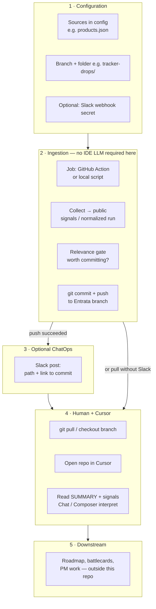
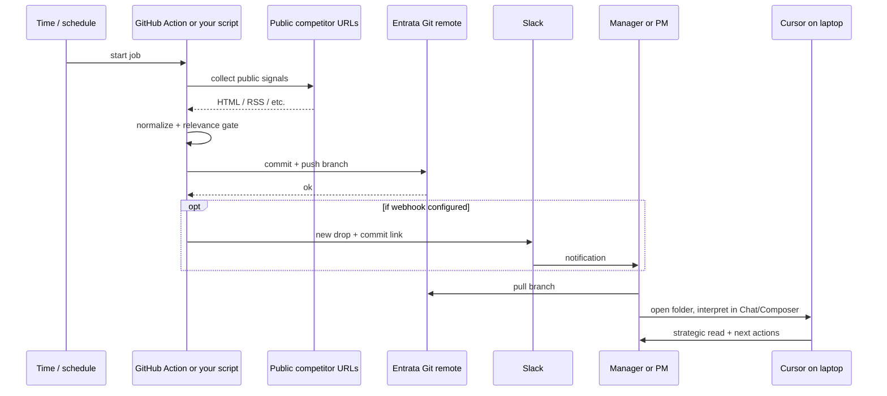
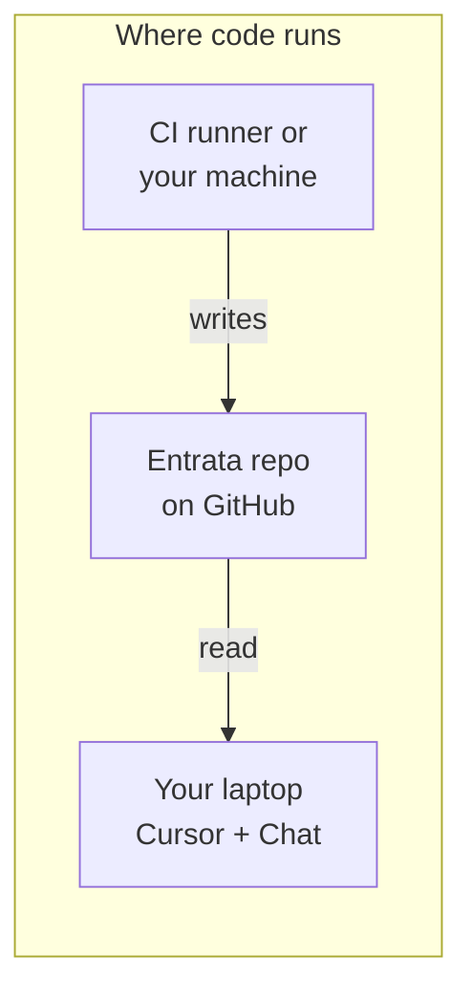

# Tracker: architecture & end-to-end flow (Git, Cursor, ChatOps)

**Audience:** anyone who needs the **target model** in one place — from “we care about a competitor” to “a human interpreted this in Cursor” — plus **where each piece runs** and **how Slack** fits in.

**Note:** the in-repo `initiative-1-tracker/tracker` server UI may still exist for local **debugging** of collection and rules; the **value story** for the org is: **evidence in Git** + **interpretation in Cursor** + **optional Slack**.

---

## Visual overview (diagrams)

### High-level pipeline

### Who touches what (sequence)

### Jobs vs runtime (one slide)

---

## Principles (three jobs, unchanged in spirit)

1. **Job 1 — Collect.** A runner gathers **raw** public signals. It can be a **CI job** or a **local script** that then **commits** — not necessarily a public “Tracker server product.”

2. **Job 2 — Interpret (human + Cursor).** The **strategic** layer is done in the **IDE** (Chat/Composer) on a checked-out branch — **not** as a 24/7 headless org LLM key for every row unless you explicitly add that.

3. **Job 3 — Durable record.** A **commit on the agreed branch** is the **source of truth** for “what we know this run” and is reviewable in **Git, PRs, and Cursor.**

---

## 1. Configuration (one-time, ongoing)

| Step | What happens | Owner |
|------|----------------|--------|
| 1a | Competitor **sources** (RSS, pricing, careers, YouTube, etc.) live in config (e.g. `tracker/config/products.json`). | PM / Alonso |
| 1b | “Our state” or product context stays in the repo config you already use. | PM / Eng |
| 1c | A **dedicated Entrata Git branch** (e.g. `Alonso-tracker-bot`) and **path in repo** for output (e.g. `tracker-drops/`) are agreed. | Alonso + manager |
| 1d | (Optional) **Slack** webhook, channel, and message template for “new drop” are configured in GitHub or your runner. | Alonso + IT |

### Branch and repo structure (suggestion)

| Piece | Suggestion |
|-------|------------|
| **Branch** | e.g. `Alonso-tracker-bot` or `feature/tracker-drops` — one long‑lived branch or a naming convention per quarter. |
| **Path** | e.g. `tracker-drops/<ISO-date-or-run-id>/` so `main` stays clean if policy requires. |
| **Per run** | `signals.json` or equivalent, `SUMMARY.md` (human-first), optional `manifest.json` (source list, time). |
| **Never commit** | API keys, private URLs, PII, non-public Entrata data. |

**Manager workflow:** `git pull` the branch, open the latest folder, use Cursor — no separate “log into a tracker app” if you do not need it.

---

## 2. Ingestion (automation, no “interpret” LLM in this step)

| Step | What happens | Where it runs |
|------|----------------|---------------|
| 2a | A **job** (scheduled: GitHub Action, or manual: script) runs the **collect** pipeline. | GitHub Action / local Node |
| 2b | The job hits **public** sources only, writes **signals** in the shape your collector uses. | Same |
| 2c | A **relevance** gate (diff, threshold, “something changed”) decides if this run is worth **committing**. | Same |
| 2d | If yes: **commit and push** to the **branch** under the agreed **folder** (e.g. `tracker-drops/2026-04-22T1530Z/`). | Git |

This stage does **not** need an Anthropic API key for the **strategic** story in the manager path: the product is **durable files in Git**, not an always-on API for PM.

**Where it runs (table)**

| Component | Runs on | Network |
|-----------|---------|--------|
| **Collect** | GHA, laptop, or small VM | Outbound to **public** config URLs only |
| **Push** | Same job, `contents: write` token | **Git** |
| **Slack** | Same or follow-up step | Outbound to Slack |
| **Cursor** | **Your machine** when the repo is open | Cursor’s IDE usage |
| **Local `npm run serve`** | Optional, **dev** only | Localhost |

---

## 3. Notification (ChatOps — optional)

| Step | What happens |
|------|--------------|
| 3a | After a **successful push** to the branch, a workflow can post to **Slack**. |
| 3b | **Short, actionable** message: branch, folder, link to **commit/PR**, “pull and open in Cursor.” |
| 3c | (Optional) Ping a channel; tune volume so it does not spam. |

**Spec (implementation comes in a follow-up PR):**

- **Trigger:** e.g. `push` to the tracker branch (path filter `tracker-drops/**`) or end of a scheduled job that just pushed.  
- **Message example:** “New run in `tracker-drops/2026-04-22/`, branch `Alonso-tracker-bot`, commit `<sha>`, link: `https://github.com/org/repo/commit/…` — pull and read `SUMMARY.md` in Cursor.”  
- **Build:** small **GitHub Action** + **Incoming Webhook** (or Slack app later). **Who:** you + org CI admin.  
- **v1** model: **Action pushes → optional Slack; human pulls → Cursor reads** — not “Cursor as a host for a push daemon,” and not required to post from the IDE for v1.

---

## 4. Human: pull and open in Cursor (interpretation)

| Step | What happens |
|------|----------------|
| 4a | `git fetch` and **checkout** the tracker branch (or merge per policy). |
| 4b | Open the repo in **Cursor** (multi-root with Entrata app if you use that for context). |
| 4c | Read the **new drop** — `SUMMARY.md` first, then raw signals as needed. |
| 4d | **Chat / Composer** with a project rule: interpret using **only** committed files, no live web, output exec summary + per-competitor bullets + PM actions. |
| 4e | (Optional) **Commit** interpretation as markdown on the same branch for a paper trail, or hand off to roadmap docs elsewhere. |

**Why not a “Cursor server” for the push?** The IDE does not see every `git push` in the org. **GitHub Actions** and **Slack** are the right “bots” for **automation + nudge**; **Cursor** is for **reasoning** when a human is at the desk.

---

## 5. Downstream: respond and ship

| Step | What happens |
|------|----------------|
| 5a | PM/Eng turn interpretation into **roadmap / battlecards** outside this repo. |
| 5b | (Optional) **PR** to `main` only for safe, non-secret artifacts — or keep everything on the side branch. |
| 5c | Repeat on a **cadence** (weekly) or when config/sources change. |

---

## 6. Relationship to older ideas (intentional)

- A **dedicated Tracker server** with org **LLM keys** for every gap: **not** the goal here; see `_archive/LLM-GATEWAY-MVP.md` for **history** only.  
- **Local** `npm run serve` report UI: **dev/demos**; not the default manager path.

---

## 7. Next implementation (when you open the PR)

1. **Done in-repo:** `tracker-drops/<run>/` layout + **`initiative-1-tracker/tracker/scripts/publish-drop.js`** + workflow **`.github/workflows/tracker-drop.yml`** (collect → relevance gate → commit/push on this repo). Details: **[TRACKER-DROP-CI.md](./TRACKER-DROP-CI.md)**.  
2. **Optional Slack:** set repository secret **`SLACK_WEBHOOK_URL`** (Incoming Webhook); workflow posts only when a drop commit was pushed.  
3. **Cross-repo (Entrata or dedicated remote):** wire PAT + `git push` to the **target** repo/branch per org policy — see **TRACKER-DROP-CI.md** § “Pushing drops to a different repo”.  
4. Link this doc from root / `initiative-1-tracker` README (already: [docs/README.md](./README.md)).

---

## 8. What this document does *not* cover

- **Exact** YAML, Slack app registration, or legal review of scraping — each gets its own checklist / ticket.  
- **Entrata** internal app deploy — out of scope.

**Related:** [initiative-1-tracker/CONTEXT.md](../CONTEXT.md), [COMPETITOR-DATA-PULL-REFERENCE.md](./COMPETITOR-DATA-PULL-REFERENCE.md), [ENTRATA-CODE-IN-CURSOR.md](./ENTRATA-CODE-IN-CURSOR.md) (multi-root), [SURFACE-INVENTORY.md](./SURFACE-INVENTORY.md).

---

## ASCII (compact)

`config → collect job → relevance? → commit+push → (Slack?) → human pull → Cursor → PM/roadmap`
