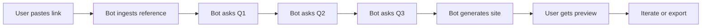

# ProspectPortal — Bot flow wireframe

Step-by-step user flow: paste link → answer 3 questions → bot generates site → user gets preview. Suitable for implementation or a simple Figma/sketch.

---

## 1. Flow overview (Mermaid)



---

## 2. Step-by-step (wireframe narrative)

### Step 1: User pastes link

- **Screen:** Single input: “Paste the link to the site you’re working on (WordPress, current site, or any reference).”
- **Control:** Text field + “Continue” (or “Analyze”).
- **Validation:** URL format; optional check that the URL is reachable.
- **Output:** Link stored; bot proceeds to ingest.

---

### Step 2: Bot ingests reference

- **Backstage:** Bot fetches the URL (or uses a headless browser / parser), extracts structure (sections, headings, nav), style hints (colors, fonts if detectable), and content type (marketing, portfolio, blog, etc.). No user UI required; can show a short “Analyzing your reference…” state.
- **Output:** Internal representation of reference (structure + style hints) passed to the next step.

---

### Step 3: Bot asks Q1 (goal)

- **Screen:** “What’s the single most important thing you want visitors to do or feel when they land on this site?”
- **Control:** Text area or short multiple choice + free text. “Next.”
- **Output:** `goal` stored.

---

### Step 4: Bot asks Q2 (audience)

- **Screen:** “Who are you trying to reach first? (e.g. job title, industry, or type of visitor)”
- **Control:** Text field or chips + free text. “Next.”
- **Output:** `audience` stored.

---

### Step 5: Bot asks Q3 (must-haves)

- **Screen:** “List up to 3 things that must be on the site in the first version (e.g. pricing, testimonials, contact form).”
- **Control:** Three short fields or tags. “Generate site.”
- **Output:** `must_haves` (list) stored.

---

### Step 6: Bot generates site

- **Backstage:** Compelling models + CSS tools produce full site from: reference structure/style + goal + audience + must_haves.
- **User sees:** Loading state (“Building your site…”) with optional progress or estimated time.
- **Output:** Generated HTML/CSS (and optionally assets) ready for preview.

---

### Step 7: User gets preview

- **Screen:** Full-page preview of the generated site (iframe or live render). Optional: “Edit” or “Regenerate” or “Change answers.”
- **Controls:** “Export” (download ZIP or push to host), “Iterate” (go back to Q1–Q3 or link), “Share link” (if hosted preview).
- **Output:** Client has a usable first draft; can refine or hand off.

---

### Step 8: Iterate or export

- **Iterate:** Return to Q1, Q2, Q3, or paste a new link; regenerate.
- **Export:** Download or deploy; optional integration with host (e.g. Netlify, Vercel) or marketplace (see Initiative 3).

---

## 3. Simple UI sketch (ASCII)

```
+------------------------------------------+
|  ProspectPortal                          |
+------------------------------------------+
|  Paste your reference link:              |
|  [https://example.com/current-site    ]  |
|  [ Continue ]                            |
+------------------------------------------+

        ↓ (after ingest)

+------------------------------------------+
|  What's the main goal of the site?       |
|  [ Get demo signups                    ] |
|  [ Next ]                                |
+------------------------------------------+

        ↓ (Q2, then Q3)

+------------------------------------------+
|  List 3 must-haves for the first version|
|  [ Pricing ] [ Contact form ] [ Case study]|
|  [ Generate site ]                       |
+------------------------------------------+

        ↓ (after generation)

+------------------------------------------+
|  Your site is ready                      |
|  +------------------------------------+  |
|  |  [ Live preview of generated site]|  |
|  +------------------------------------+  |
|  [ Export ] [ Iterate ] [ Share ]        |
+------------------------------------------+
```

---

*Part of the three initiatives plan. See [ACTION-PLAN.md](../ACTION-PLAN.md).*
