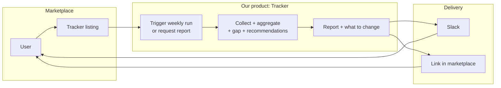
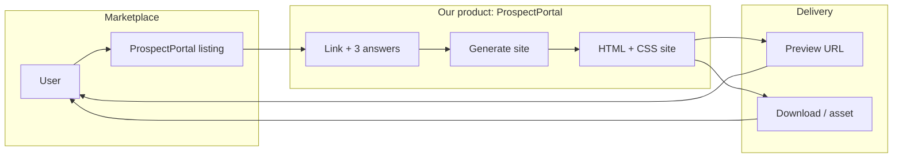
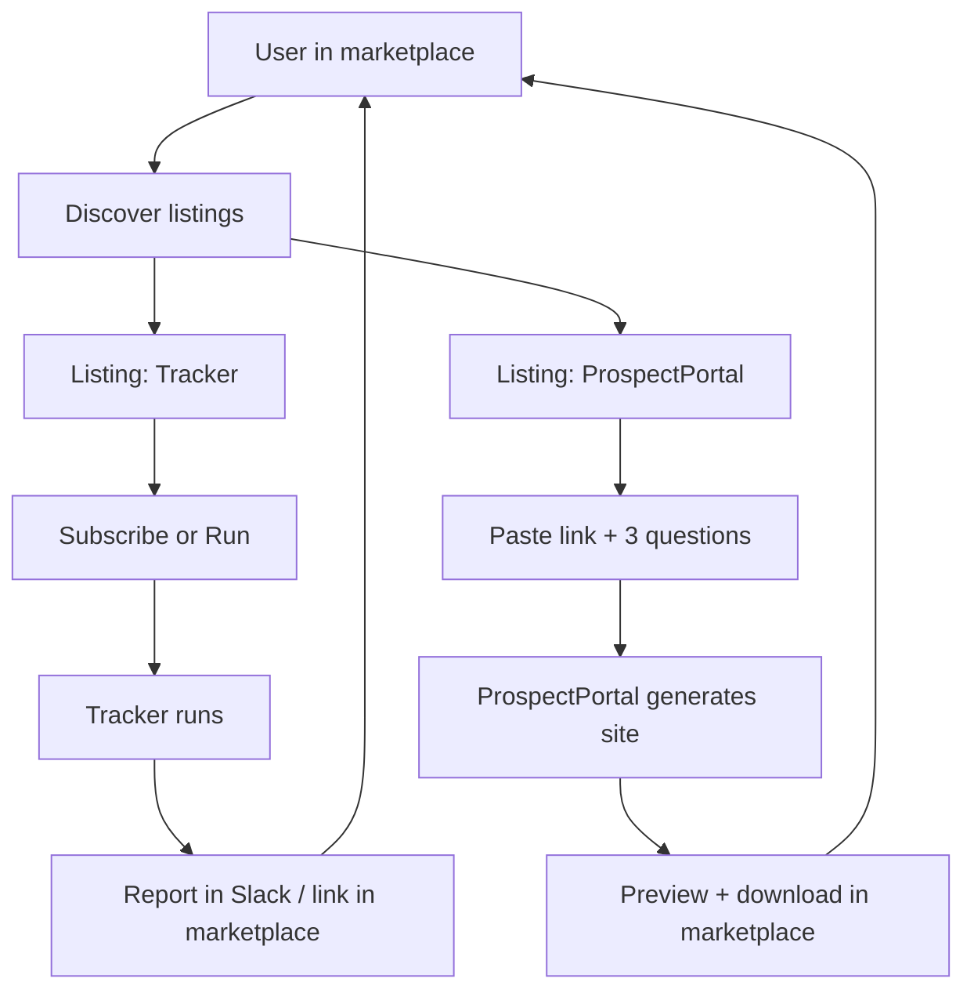

# Our flow in the marketplace — Diagram and narrative

One diagram for “User in marketplace → [our product] → outcome” for both Tracker and ProspectPortal, plus a short narrative.

---

## 1. Tracker Bot flow in marketplace

User discovers and uses the Tracker (weekly report + gap + recommendations) from the marketplace.

**Narrative:** User finds the Tracker listing in the marketplace. They subscribe (e.g. weekly) or click “Run” / “Get latest report.” Our Tracker runs (or the last run is used), and the output is delivered via Slack and/or as a link or attachment in the marketplace. User sees the report in Slack and/or opens the link in the marketplace.

---

## 2. ProspectPortal flow in marketplace

User requests a generated website from ProspectPortal via the marketplace.

**Narrative:** User finds the ProspectPortal listing. They open the experience (in marketplace or linked). They paste a link and answer the 3 questions (in marketplace UI or our hosted flow). ProspectPortal generates the site. The result is shown as a preview URL and/or downloadable asset (or stored as a marketplace asset). User views or downloads from the marketplace.

---

## 3. Combined view (both products in marketplace)

---

## 4. What we need from the marketplace

For these flows to work, the marketplace should support (or we build):

| Need | Tracker | ProspectPortal |
|------|---------|-----------------|
| **Listing** | One listing (e.g. “Tracker Competitors Bot – weekly report”). | One listing (e.g. “ProspectPortal – generate a site”). |
| **Trigger** | Way to “subscribe” or “run” (schedule or on-demand). | Way to start the flow (open app or “Request site”). |
| **Input** | Possibly none (Tracker runs on schedule) or “product/competitor” selection. | Link + 3 answers (form in marketplace or link to our UI). |
| **Output** | Report URL or file; optional Slack. | Preview URL + download or asset. |
| **Identity** | Optional: pass user/org so we know where to send Slack. | Optional: associate generated site with marketplace user. |

---

*Part of the three initiatives plan. See [ACTION-PLAN.md](../ACTION-PLAN.md).*
